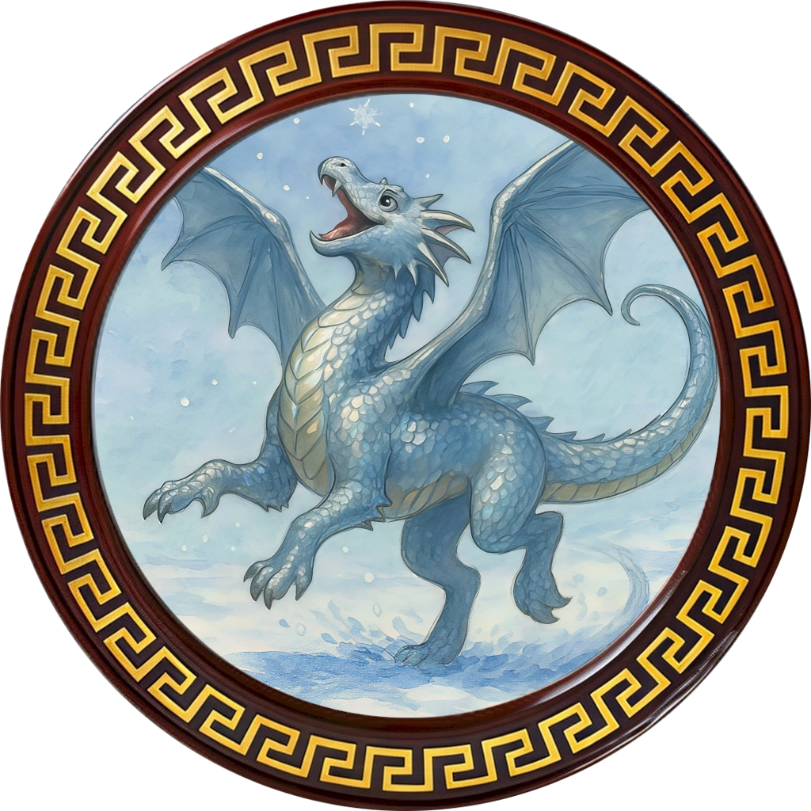
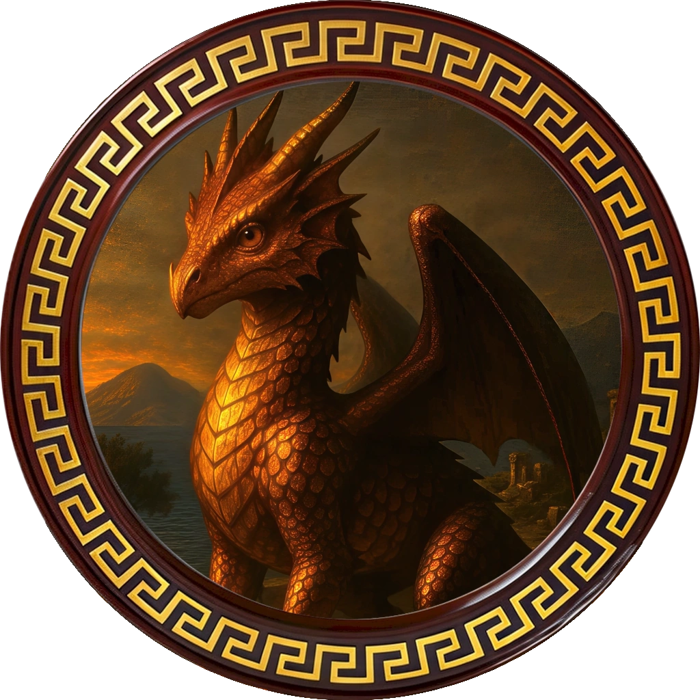
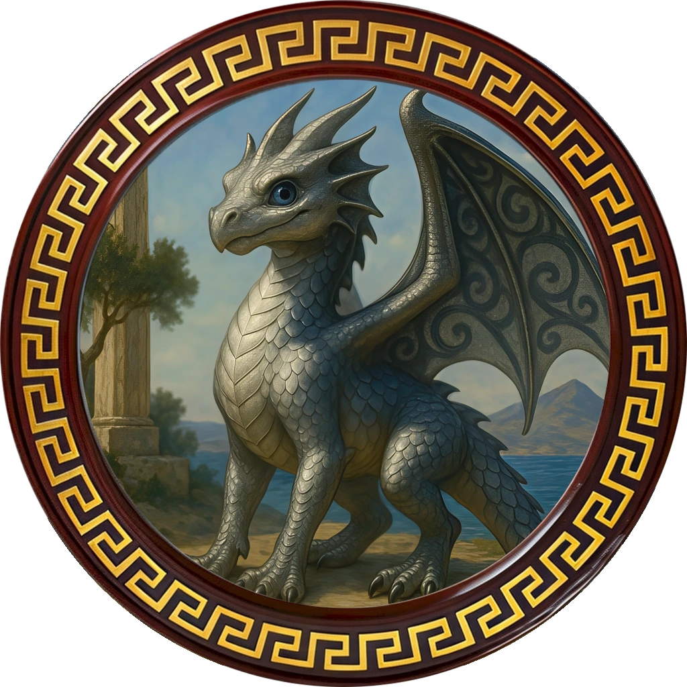

# The Dragons of the Ultros

This document details the three young dragons hatched by the party under the guidance of the Lotus Witch during the Ritual of Waking Dreams.

---

## Soraya (Astraeus's Dragon)

*   **Player:** Astraeus
*   **Name:** Soraya
*   **Type:** Silver Dragon (Female)
*   **Personality & Origin:** Soraya is a "big goof" with a playful spirit, but her lighthearted nature belies a profound intellect and artistic soul. Her spirit was forged in the halls of a **Mystical Academy**, giving her a deep-seated curiosity and a mind steeped in lore and magic. Her years were spent in **shared artistic creation** with Astraeus, making her both a muse and a masterpiece in poetry and song. Their **bond of equals** is one of deep, abiding respect, two halves of a single heroic whole.

---

## Avia (Delphi's Dragon)

*   **Player:** Delphi Silverstar
*   **Name:** Avia
*   **Type:** Bronze Dragon (Female)
*   **Distinctive Feature:** A patch of silver scales in the shape of a lightning bolt on her chest.
*   **Personality & Origin:** Avia's spirit was forged in the crucible of a **Chaotic Battlefield**, making her resilient, tough, and keenly aware of the harsh realities of the world. Her life has been one of **endless exploration**, a true survivor forever seeking what was lost. Her bond with Delphi is a **sanctuary of trust**; they are each other's secret keeper and comfort, a refuge from a harsh world.

---

## Argon (Rhaena's Dragon)

*   **Player:** Rhaena
*   **Name:** Argon
*   **Type:** Silver Dragon (Male)
*   **Personality & Origin:** Argon's spirit was honed in a **Dangerous Wilderness**, sharpening his senses by the unforgiving lessons of survival. His raw power was tempered by **relentless martial training**, making him a deadly and disciplined weapon reflective of Rhaena's paladin code. Their bond is a primal, sacred duty as **guardian and ward**; he is her unyielding protector, and in his loyalty, she finds the strength to face her own darkness. 