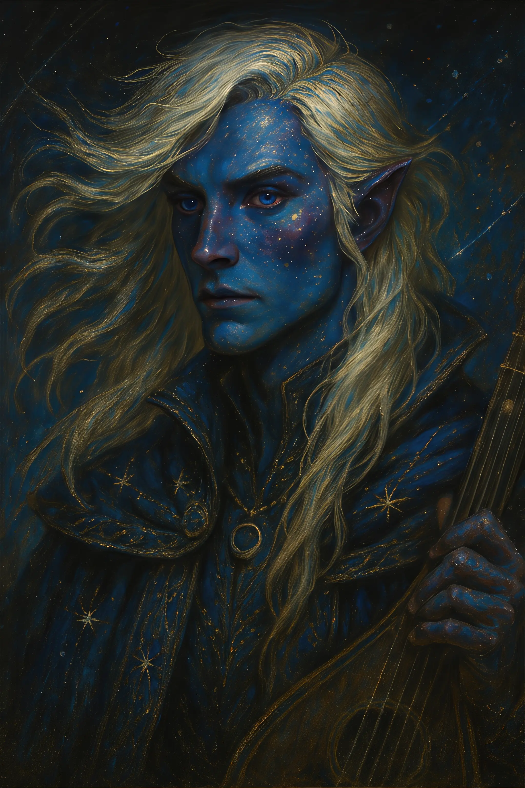
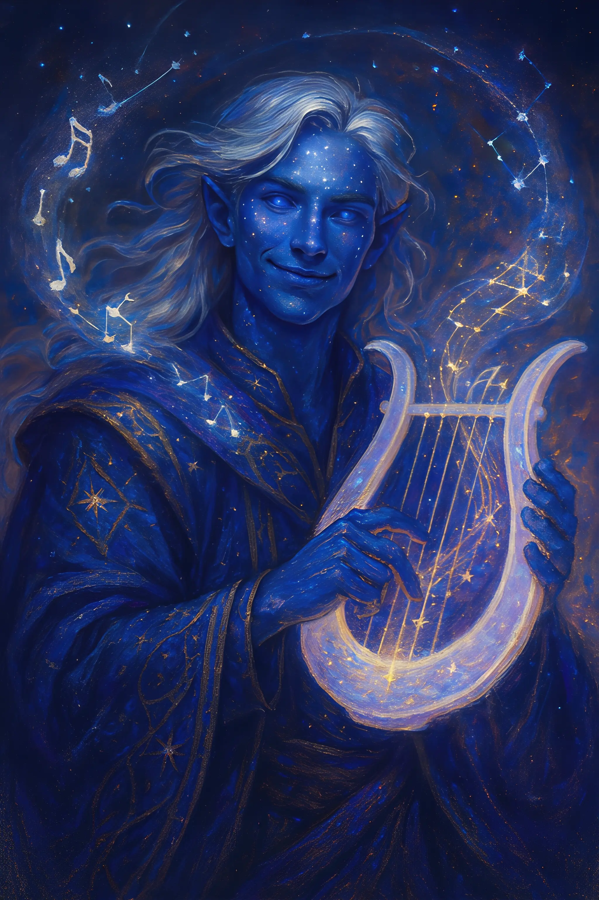
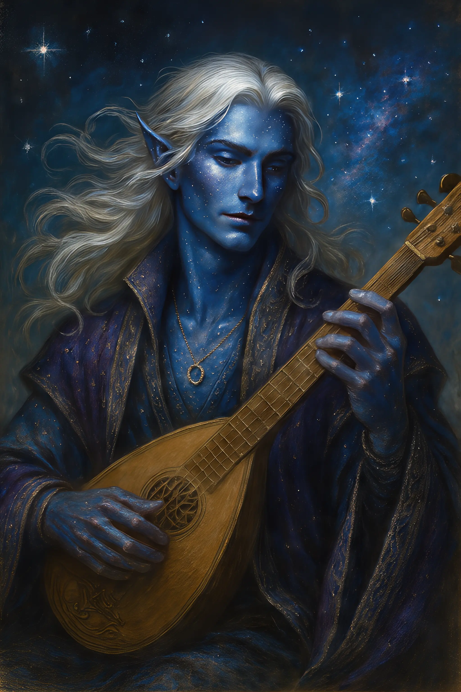
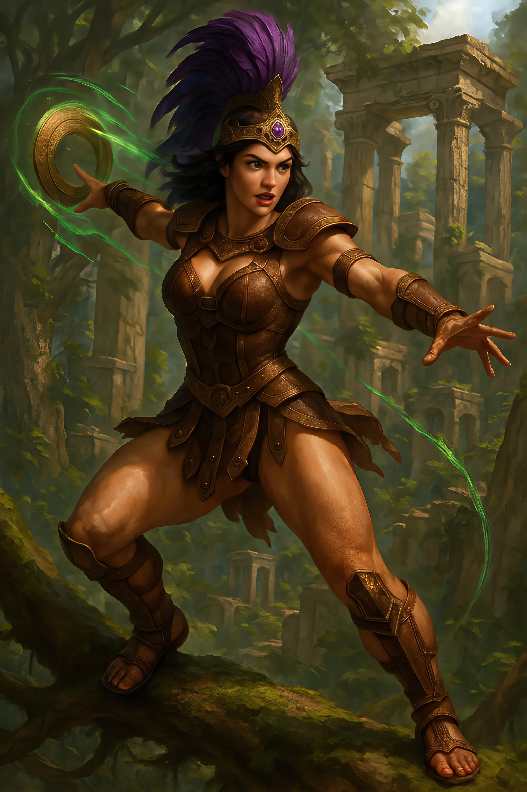
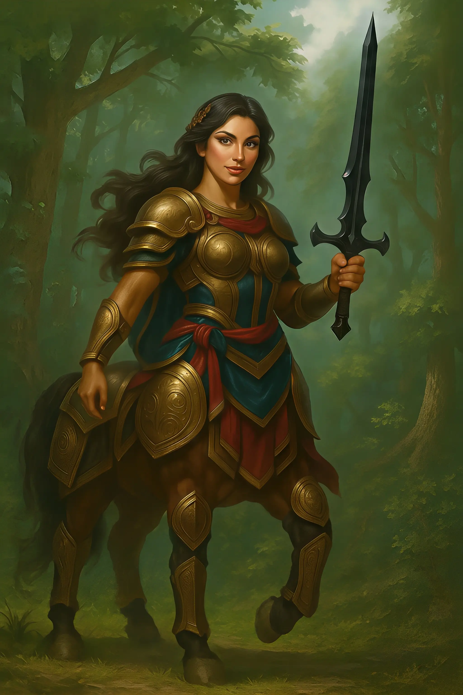

# PLAYER CHARACTERS

## Astraeus

<!--

-->
An Aurae (fey race) multiclass College of Epic Poetry Bard (6) and Hexblade Warlock with high
charisma (20) and the "Curious One" epic path. Wields bardic inspiration (d8), dissonant whispers,
vicious mockery, eldritch blast, and healing magic. Carries a light crossbow, daggers, and the
enchanted Shortbow of Cupid. Has natural abilities including Enthralling Beauty and Aurae Ancestry.
Master of persuasion and performance with Jack of All Trades allowing him to add half his
proficiency bonus to any ability check. Able to cast ritual spells and inspire allies with powerful
bardic magic that can be used in combat. 

Epic Path: The Curious One. 

#

## Delphi Silverstar

A human male wizard (School of Evocation) and tempest domain cleric with "The Vanished One"
background. Highly intelligent (20) spellcaster specializing in lightning and elemental magic.
Wields powerful spells including Lightning Bolt, Thunderwave, and Fire Bolt. Possesses Channel
Divinity abilities including Destructive Wrath and Turn Undead. Carries magical artifacts including
the Shield of Volkan, Scepter of King Driptongue, and Crown of Dragonlords. His personality combines
curiosity about his new surroundings ("I'm fascinated by the beauty and wonder of this new land")
with connection to foreign traditions ("I honor my deities through practices that are foreign to
this land"). Has darkvision and the Resilient (Con) feat. 

Epic Path: The Vanished One. 

#

## Aella Swiftstrike

An exiled Amazon warrior from the Isle of Themis with regal bearing and fierce independence.
Daughter of royalty whose mother was murdered and deposed from the throne. Expert in chakram
techniques, possessing exceptional dexterity and constitution. Wields a magical +2 mithral chakram
capable of hitting multiple targets with ricochet techniques. Has a Stimfay companion and various
magical abilities from her Amazonian heritage. Proud and aristocratic in demeanor, believing herself
"above the unwashed masses," yet seeks to be recognized as a "hero of the people." Her fighting
style focuses on archery and thrown weapons, enhanced by sharpshooter and chakram expert feats.
Equipment includes a Scarab of Protection, fine studded leather armor, and various weapons including
additional chakrams and kopis blades. 

Epic Path: The Exile. 

#

## Rhaena

A female Thylean centaur paladin who follows the Oath of the Dragonlord (level 7) with the Haunted
One background. Strong and charismatic with impressive speed (40 ft). Wields longswords, spears, and
various divine smite abilities including Thunderous Smite, Branding Smite, and Wrathful Smite.
Possesses centaur racial abilities like Charge and Quadrupedal Stride, alongside paladin features
including Lay on Hands, Divine Sense, and Divine Health. Has a pseudodragon familiar. Her
personality is defined by her monster-hunting purpose: "I kill monsters to make the world a safer
place, and to exorcise my own demons" and her secretive nature: "I expect danger around every
corner. I don't talk about the thing that torments me. I'd rather not burden others with my curse."

Epic Path: The Haunted One.

