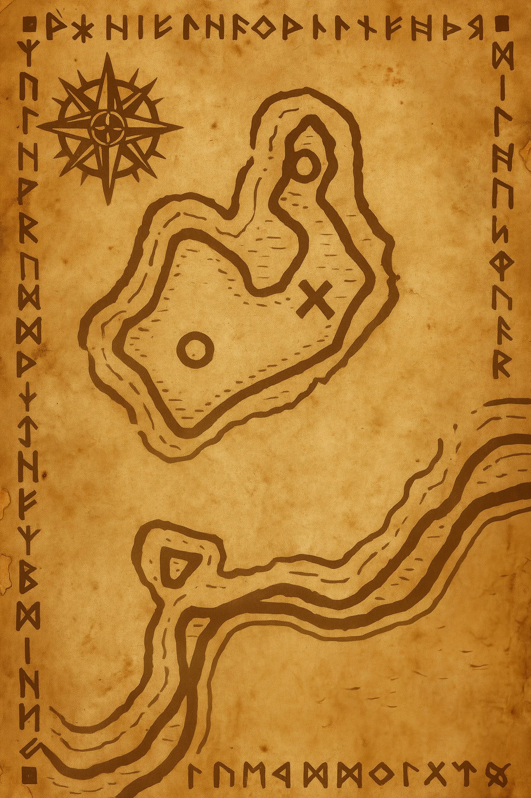

# The Map from Director Koldar’s Chest

A folded, weathered parchment map was discovered inside Koldar’s trapped chest.

The map shows an island drawn in heavy ink lines, with runes and notes written entirely in Dwarvish script.

Characters who can read Dwarvish were able to translate several labels:

*   The island is called **Cairnhollow Isle**.
*   A southern peninsula is labeled **The Nail**.
*   One area on the island is marked with a large **X**, beside the word *dŭmril* (the dwarvish term for **Black Mithral**).

Additional dwarvish annotations appear across the map, though they were not translated or discussed in full during the session.

