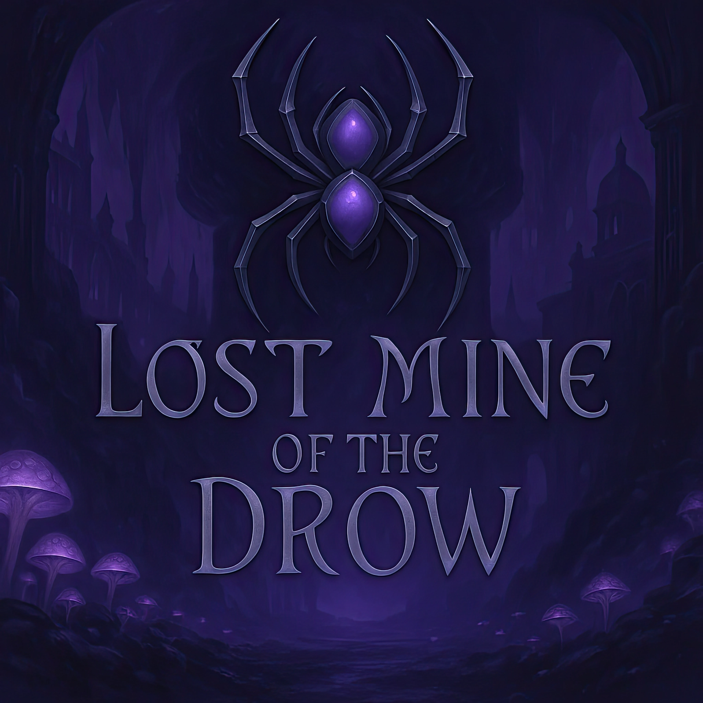

# Monday

<link rel="stylesheet" href="drow_theme.css">

  

Welcome to the Monday campaign! Here you'll find recaps, character info, and more. 

---

## Looking for a New Player?

We are currently looking for one more player to join our Monday night D&D 5e campaign. If you found this site via a QR code, welcome!

### The Pitch
What if you were the other side of the story? Join a drow noble house of magical artificers on a desperate mission. This campaign runs parallel to "Lost Mine of Phandelver," but from the villain's point of view.

### The Vibe
*   Morally complex characters with personal stakes.
*   Family loyalty, politics, and difficult choices.
*   Playing characters who aren't traditional heroes but have believable motivations.

### Who We're Looking For
*   One reliable player (21+) for a character-driven story.
*   We want someone excited by moral complexity and political intrigue.
*   A team player who enjoys collaborative storytelling.

### Your Character
Your character will be an integral part of House T’alzar’s fight for survival. We prioritize a compelling character concept over any specific role or class—all are welcome.

### The Details
*   **When**: Mondays, 6:30 PM to 10:30 PM
*   **Where**: We play in the [Crescent Heights neighborhood of St. Petersburg, FL](https://www.google.com/maps/place/Crescent+Heights,+St.+Petersburg,+FL+33704/@27.7957706,-82.6440311,18z/data=!3m1!4b1!4m6!3m5!1s0x88c2e1672ab42fdf:0xa01c80cba8acd4a9!8m2!3d27.7948849!4d-82.6415919!16s%2Fg%2F1tj4zhds?entry=ttu&g_ep=EgoyMDI1MDcyMy4wIKXMDSoASAFQAw%3D%3D).
*   **Vibe**: Established, casual group. We share food/drinks.

### How to Apply
If you're interested, please email us at **st.pete.dnd@outlook.com**. We're looking for a player who is ready to get into character and can join us every Monday night. 