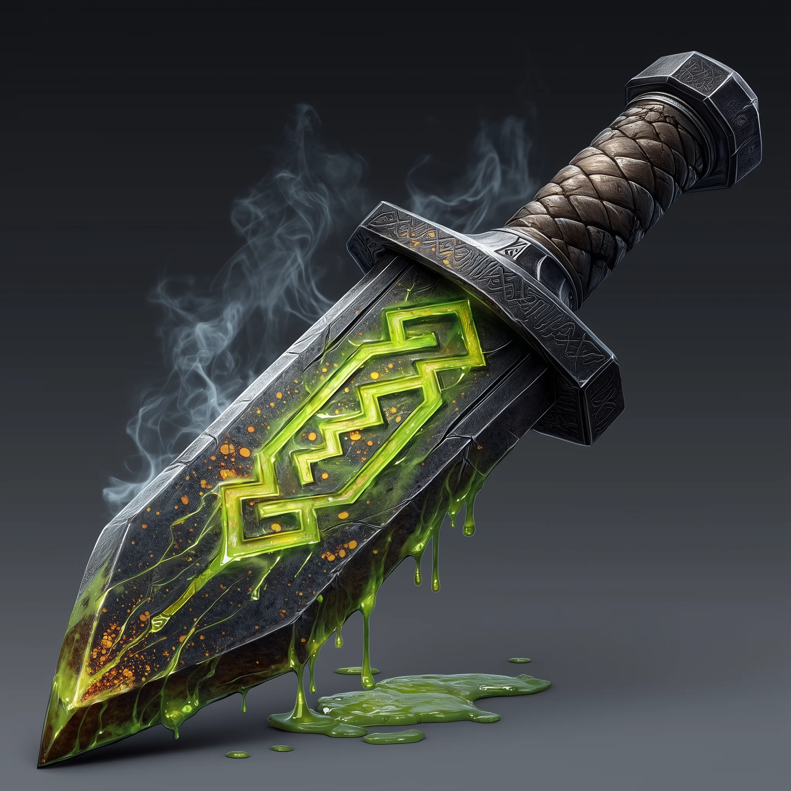

# Clan Firebeard Ceremonial Dagger

*Weapon (Dagger), Rare (requires attunement)*

---

The blade itself releases a thin, acrid smoke. Where a droplet falls, it eats into the surface with an audible hiss, leaving a pitted, corroded mark. The entire weapon feels dangerous to the touch, radiating a subtle, corrosive energy.

### Properties

**Magic Weapon:** This is a **+1 magical weapon**, granting a +1 bonus to attack and damage rolls.

**Caustic Edge:** The dagger deals an extra **1d6 acid damage** to any target it hits.

**Returning:** This dagger has the throwing property (range 20/60). After it is thrown, the wielder can use a free action to cause the dagger to fly back to their hand. If the path back to you is blocked by a creature, the dagger falls to the ground in the space in front of that creature. If the path is blocked by a non-magical object, the dagger will press against it, automatically dealing its **1d6 acid damage** to the object at the end of each of your turns until the path is cleared.

**Corrosive Touch:** As an action, a creature attuned to the dagger can command it to leak a potent acid. This acid is strong enough to corrode through non-magical ropes, leather, and wood in a matter of seconds. It can pit and weaken common metals like iron or steel over several minutes, but would take hours to fully dissolve a stout bar. Glassware and quasi-magical metals such as mithral are unaffected.

**Ricochet Strike (Requires Attunement and Level 7):** When you throw the dagger and use a free action to recall it, you can direct its return path. Choose one creature within a 10-foot wide line between you and the location the dagger was thrown to. You can make a single attack roll against this new target as the dagger flies back to your hand. You can use this feature once per turn.

*The returning and acid damage properties are only active for a creature attuned to the dagger. Without attunement, it functions as a basic +1 dagger.*
