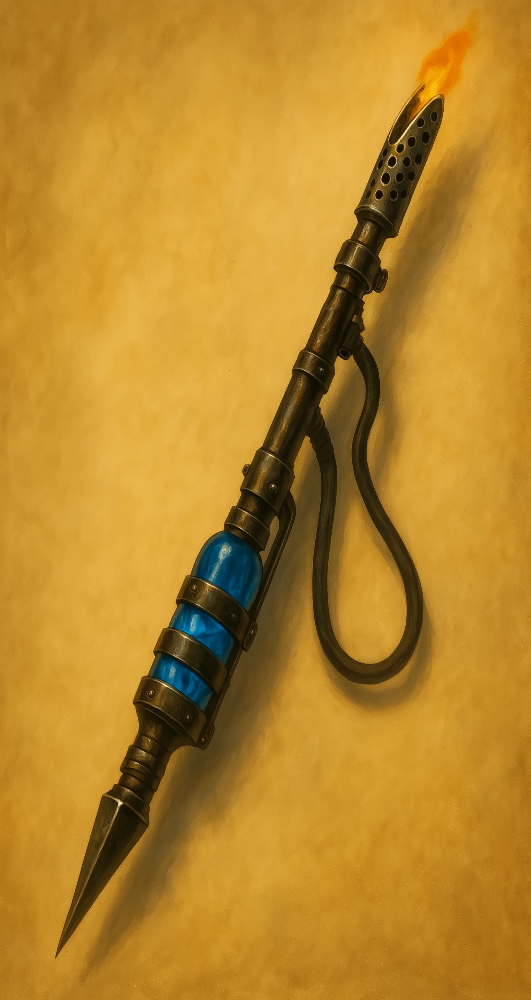

# **Duergar Fire Lance**

*Weapon (lance), rare*
**Does not require attunement**

This dwarven-forged lance bristles with pipes, valves, and a blackened steel spearhead. Fueled with volatile alchemical fire, it spits jets of flame in addition to piercing attacks.

---

**Weapon Type.** Lance (martial melee weapon, PHB rules).
**Properties.** Reach, special (disadvantage when attacking a target within 5 ft.; two-handed when not mounted).

**Melee Attack — Piercing Strike.**

* Damage: **1d12 piercing**
* **Enlarged Strike.** If you are a duergar or under the effect of *Enlarge*, damage becomes **2d12 piercing**.
* **Fuel-Enhanced Strike.** If the lance is fueled, melee strikes also deal **+1d6 fire damage**.

---

### **Flame Jet (Requires Fuel)**

As an action, expend **1 fuel charge** to unleash fire in one of two patterns:

* **Cone:** 15-foot cone
* **Line:** 30-foot line, 5 feet wide

Each creature in the area must make a **DC 12 Dexterity saving throw**, taking **3d6 fire damage** on a failed save, or half as much on a success.

**Overpressure.** After using Flame Jet, roll a d6. On a 1, the lance overheats and cannot use Flame Jet again for one minute. 

---

**Fuel Requirement.** The Fire Lance requires **Alchemical Fire Canisters**. Without fuel, it functions only as a mundane lance. Refueling the fire lance takes an action to install the fuel pack.

---

# **Alchemical Fire Canister**

*Wondrous item, uncommon*

A heavy brass cylinder filled with volatile alchemical gel. It powers the Duergar Fire Lance or similar devices.

* **Capacity:** Each canister holds **3 charges**.
* **Use:** 1 charge powers a **Flame Jet** or fuels melee bonus fire damage for **1 minute of combat**.
* **Cost:** 50 gp per canister.
* **Weight:** 2 lb.
* **Crafting:** An **artificer or alchemist** can create a canister with 1 day of work and 25 gp in raw reagents (alchemy supplies required).

---

### **Availability**

* Common among duergar in the Underdark.
* Rare but purchasable in major cities, artificer guilds, or alchemist enclaves.

---

