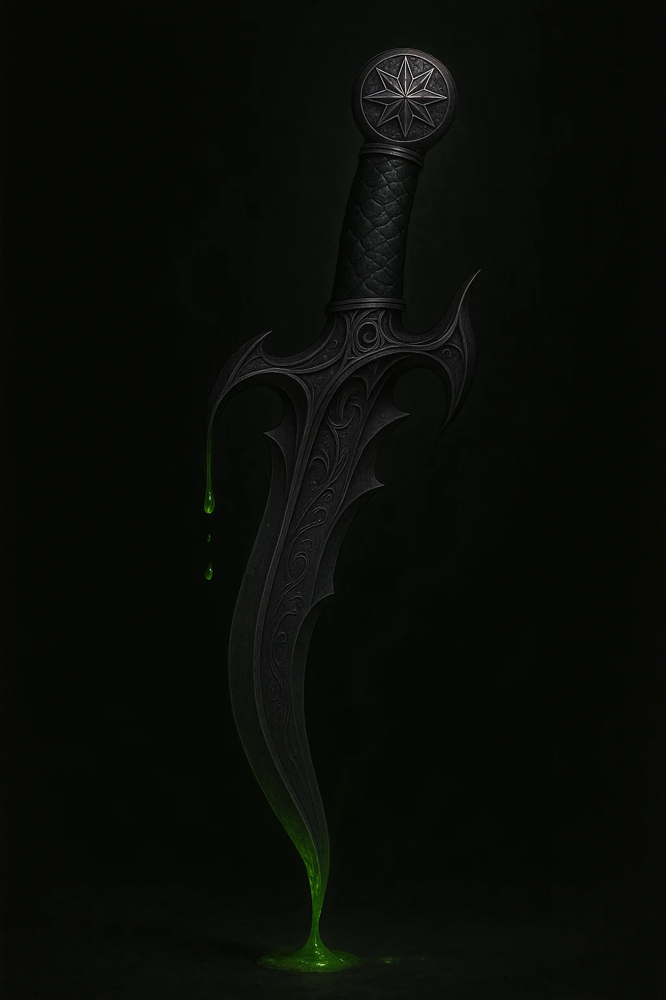

# Malexa's Stiletto

*Weapon (Dagger), Very Rare (requires attunement)*

---

This **+1 dagger** has a slender, wicked-looking blade crafted from dark, polished steel that seems to drink the light. The hilt is wrapped in the hide of a cave lizard, and its pommel bears the eight-pointed star of House Glutthraz. The weapon hums with a predatory magic, guiding the wielder's hand to strike not just once, but twice at a foe's exposed weakness.

### Properties

**Magic Weapon:** You gain a +1 bonus to attack and damage rolls made with this magic weapon.

**Venomous Strikes:** On a hit, the dagger deals an extra **2d4 poison damage**.

**Glutthraz Gambit:** While you are wielding this dagger in your off-hand, you can channel its ruthless magic to exploit an opening. If you use your Action to make an attack that benefits from your Sneak Attack, you can use your Bonus Action to make one attack with this dagger. If that attack hits, you can apply your Sneak Attack damage to it as well, even though you have already used it this turn. You must still meet the normal requirements for Sneak Attack on the bonus action attack.

**Paralytic Kiss:** When you roll the 2d4 poison damage for this weapon, if you roll two 1s on the d4s (snake eyes), the venom surges with a paralytic neurotoxin. The poison damage for the attack becomes 8, and the target must succeed on a **DC 14 Constitution saving throw** or be **Paralyzed** until the end of your next turn.
