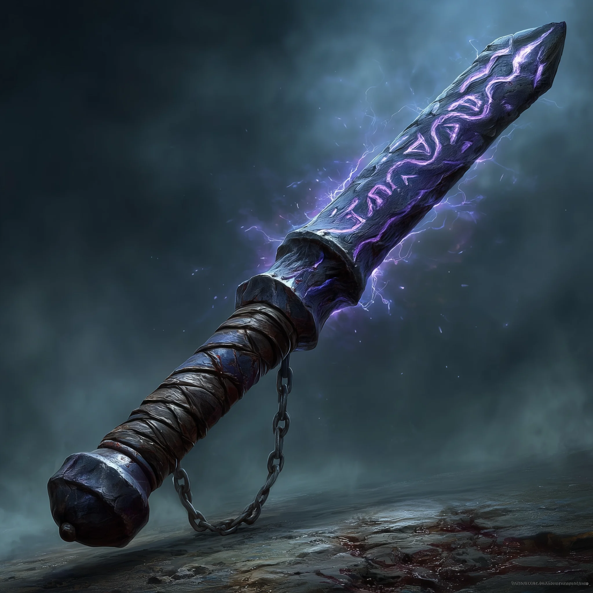

# Rod of Torment

*Wand, rare (requires attunement)*

---

This 18-inch rod of black iron is inlaid with veins of a dark, pulsing metal that glows faintly orange. The handle is wrapped in tough leather, and strange runes spiral up its length. When held, you feel an uncomfortable psychic thrum that makes your teeth ache.

The rod feels heavier than it should, and occasionally grows warm to the touch without warning.

### Properties

**Charges:** The rod has 7 charges and regains 1d4+1 charges daily at dawn.

**Dissonant Whispers (at will):** As an action, you whisper a discordant melody that only one creature of your choice within 30 feet can hear. The target must make a **DC 14 Wisdom saving throw**. On a failed save, it takes **3d6 psychic damage** and must immediately use its reaction, if available, to move as far as its speed allows away from you. On a successful save, the target takes half damage and doesn't have to move away.

**Resonant Feedback (3 charges):** As an action, you create a 15-foot cone of psychic resonance. Each creature in the area must make a **DC 14 Intelligence saving throw**, taking **3d6 psychic damage** on a failed save, or half on success.

**Torment's Echo (5 charges):** As an action, you can cast *Phantasmal Killer* (spell save **DC 14**).
