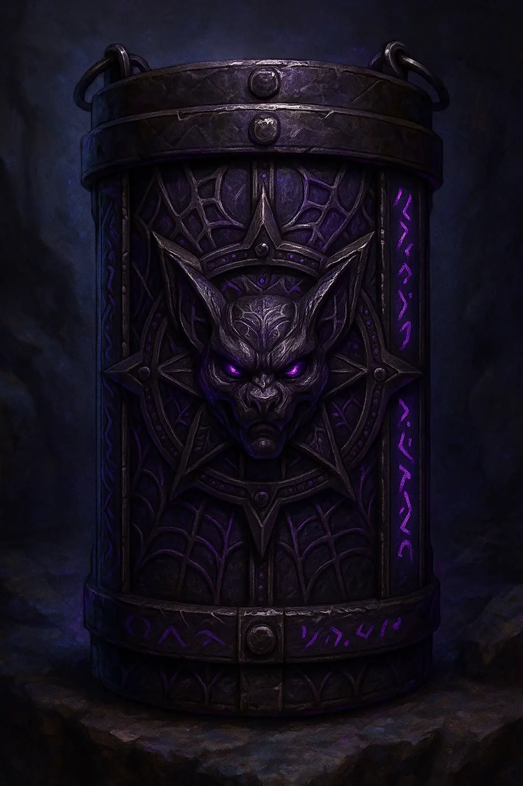
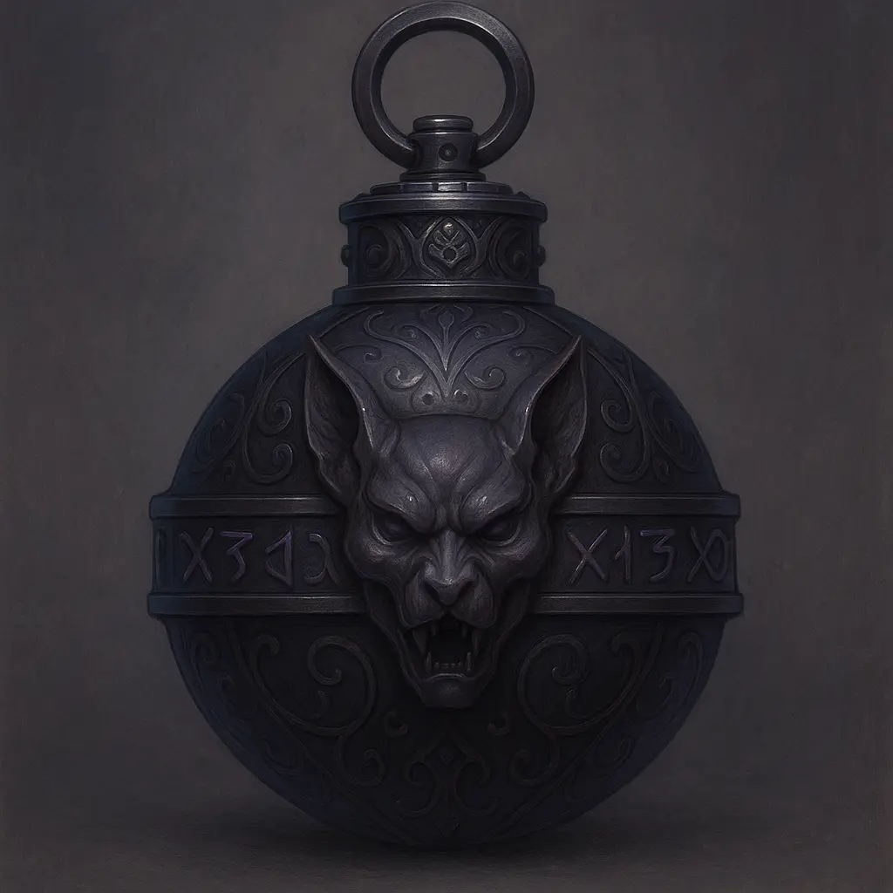

# T'alzarine Prime Explosives

<link rel="stylesheet" href="../drow_theme.css">

## Overview

T'alzarine Prime explosives represent the pinnacle of House T'alzar's artificing expertise. These military-grade devices combine alchemical compounds with harmonic resonance magic to create devastatingly effective demolition tools. Named after the house's founder, these explosives are a closely guarded family secret and a symbol of their technological superiority.

---

## T'alzarine Prime Demolition Charge - "Problem Solver"

**Type:** Wondrous item, rare  
**Weight:** 12 lb. (10 in. × 4 in. × 4 in. brick)  
**Cost:** 2,000 gp (black market)

> | **Property** | **Details** |
> |--------------|-------------|
> | **Placement** | 1 action to affix (DC 14 Dex (Sleight of Hand) or Int (Tinker's Tools)) |
> | **Arming** | 1 action to set timer (up to 1 minute, 6-second increments) |
> | **Disarm** | DC 20 Int (Arcana) or Dex (Thieves' Tools). Failure by 5+ triggers instant detonation |

### Detonation Effects

> | **Effect Type** | **Damage** | **Area** | **Save** |
> |-----------------|------------|----------|----------|
> | **Primary Target** | 10d10 force (ignores immunities) | Attached object | None |
> | **Splash Damage** | 8d6 force + prone | 10-foot radius | DC 16 Dex (half damage) |
> | **Sonic Boom** | Audible 1 mile away | — | Perception DC 5 |

**Special Properties:**
- **Chain Reaction:** Additional charges within 10 ft. detonate next round
- **Volatility:** Lightning damage or *shatter* spell forces detonation check (d20, 1-4)
- **Structural Damage:** Double damage vs. non-magical structures

---

## T'alzarine Prime Handheld Charge - "Blackfire Grenade"

**Type:** Weapon (explosive), uncommon  
**Weight:** 1 lb.  
**Cost:** 300 gp (150 gp for House T'alzar members)

> | **Property** | **Details** |
> |--------------|-------------|
> | **Activation** | 1 action to arm and throw |
> | **Range** | 40 ft + 5 × Strength modifier |
> | **Area** | 15-foot radius sphere |
> | **Save DC** | Dexterity 15 |

### Combat Effects

> | **Damage Type** | **Amount** | **Additional Effects** |
> |-----------------|------------|----------------------|
> | **Fire** | 2d6 | Combined with piercing |
> | **Piercing** | 2d6 | Combined with fire |
> | **Knockback** | — | 10 ft push + prone (failed save) |

**Volatility Risks:**
- **Fire Damage (≥10):** 15% chance premature detonation (d20, 1-3)
- **Lightning Damage (≥10):** 25% chance premature detonation (d20, 1-5)

---

## Manufacturing & Distribution

### House T'alzar Monopoly
- **Exclusive Formula:** Only family artificers know the complete process
- **Valandor's Workshop:** Primary manufacturing site
- **Quality Control:** Each charge personally inspected by senior artificers
- **Distribution:** Strictly controlled, primarily for house operations

### Black Market Value
- **Extreme Rarity:** Few examples exist outside house control
- **High Demand:** Rival houses pay premium prices for samples
- **Authentication:** Genuine charges bear hidden house marks
- **Counterfeits:** Inferior copies lack harmonic resonance core

---

## Tactical Applications

### Demolition Operations
- **Structural Sabotage:** Bringing down enemy fortifications
- **Mining Applications:** Clearing collapsed tunnels
- **Emergency Breaching:** Creating escape routes
- **Strategic Denial:** Destroying valuable infrastructure

### Combat Usage
- **Area Control:** Handheld charges excellent for crowd control
- **Ambush Tactics:** Pre-placed charges triggered during fights
- **Psychological Warfare:** The threat alone often sufficient
- **Last Resort:** When conventional weapons prove insufficient

---

## Historical Significance

### Development Timeline
- **Original Formula:** Created by T'alzar the Innovator three centuries ago
- **Refinements:** Each generation has improved the design
- **Current Version:** Valandor's enhancements make them twice as stable
- **Future Variants:** Research continues into specialized applications

### Notable Uses
- **The Glutthraz Warehouse Incident:** Demolition charges "accidentally" destroyed rival storage
- **Cinderfork Infiltration:** Charges used to breach foundry defenses
- **The Deep Tunnel Collapse:** Emergency use saved party from monster pursuit
- **Political Leverage:** Threat of explosive sabotage influences negotiations

---

## Safety Protocols

### Handling Procedures
- **Authorized Personnel Only:** House members and trusted allies
- **Protective Equipment:** Specialized containment during transport
- **Environmental Monitoring:** Temperature and magical field awareness
- **Emergency Procedures:** Established protocols for accidental arming

### Storage Requirements
- **Secure Vaults:** Magically warded storage areas
- **Climate Control:** Stable temperature and humidity
- **Separation Distance:** Charges stored individually to prevent chain reactions
- **Access Logs:** Detailed tracking of all inventory movements

---

## Game Master Notes

### Balancing Considerations
- **Setup Time:** Two actions required prevents easy combat abuse
- **Limited Supply:** Expensive and rare, preventing overuse
- **Risk vs. Reward:** Volatility adds tension to dangerous situations
- **Environmental Impact:** Explosions alert enemies and change battlefields

### Campaign Integration
- **Plot Device:** Explosives can advance story through sabotage missions
- **Character Development:** Represents House T'alzar's technological edge
- **Political Tool:** Other houses seek these weapons for their own use
- **Moral Complexity:** Destructive power raises questions about responsible use

---

*"When words fail and steel breaks, T'alzarine Prime speaks with the voice of thunder."*  
*— House T'alzar motto*