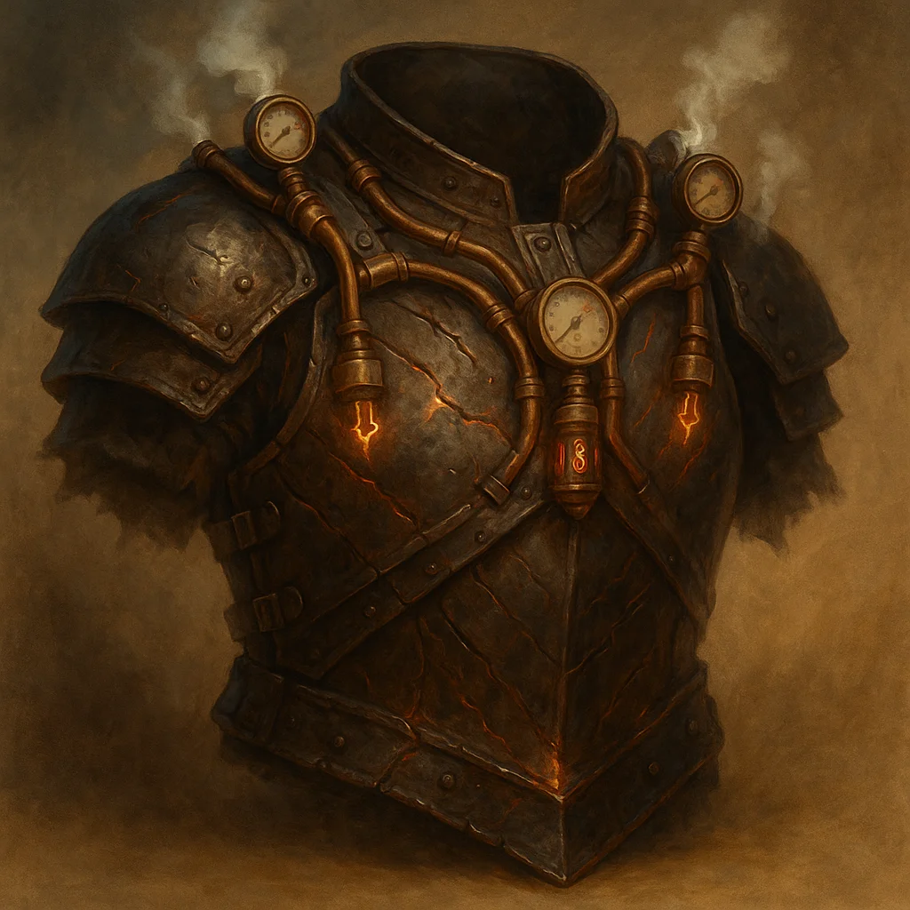

# Tholdrum's Pressure-Valve Harness

*Armor (breastplate), very rare (requires attunement by a creature that has proficiency in medium armor)*

---

This is Chief Engineer Tholdrum's signature armor, a reinforced breastplate of dark, scorched steel crisscrossed with burn-scars and integrated with a complex pressure-valve harness. It constantly hisses softly with contained steam, a testament to Tholdrum's brutal pragmatism and engineering prowess.

While wearing and attuned to this armor, you gain a **+1 bonus to your AC**. This armor functions as a **+1 Breastplate**.

You can use an action to activate one of the following properties. Each can be used once per day, regaining expended uses at dawn:

- **Pressure Vent:** You release a blast of scalding steam in a 15-foot cone. Each creature in the area must make a **DC 15 Dexterity saving throw**. On a failed save, a creature takes **4d6 fire damage** and is pushed 10 feet away. On a success, they take half damage and aren't pushed. The area becomes lightly obscured until the start of your next turn. This functions identically to Tholdrum's Pressure Vent action.

- **Superheated Strike:** As part of a melee weapon attack, you superheat your weapon. On a hit, the attack deals an extra **1d6 fire damage**. This replicates the intensified heat of Tholdrum's Steam Hammer.

In addition, once between long rests, you can use a bonus action to **Overcharge Valve**. Until the start of your next turn, you gain resistance to all damage except psychic, and your melee weapon attacks deal an extra **1d6 fire damage**. At the end of the duration, you take 5 force damage. This ability taxes the armor's core, requiring careful management.
