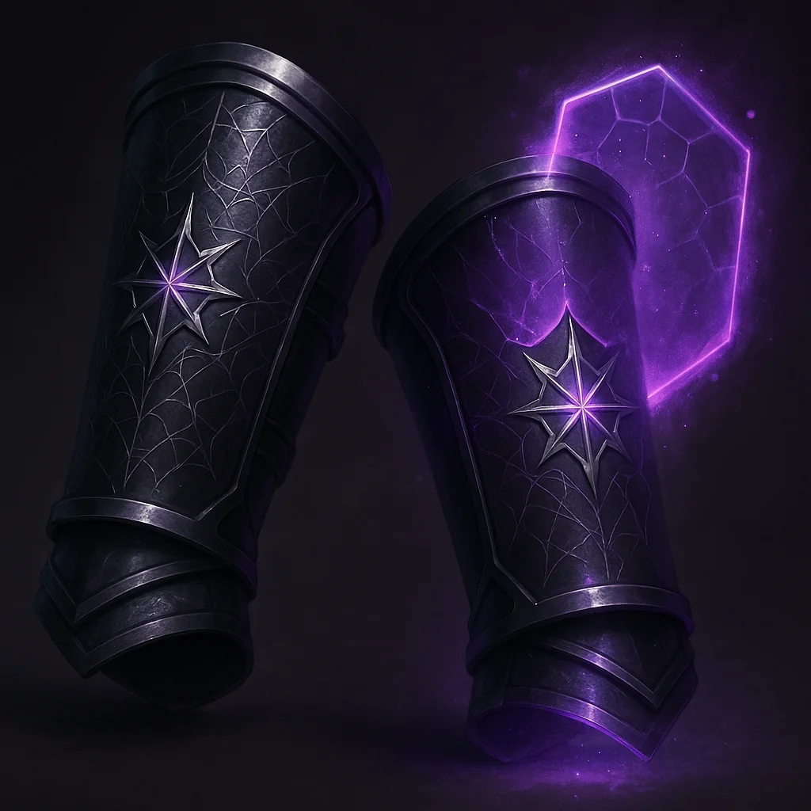

# Vambraces of Misdirection

*Wondrous Item, Very Rare (requires attunement)*

---

Forged from a dark mithral-adamantine alloy, these bracers are surprisingly lightweight yet feel incredibly durable. They are etched with shimmering arcane glyphs that seem to shift and blur at the edge of your vision.

If you are wearing no armor or light armor and using no shield, you gain a **+2 bonus to your AC**.

Additionally, you can use the bracers to cast the following spells, requiring no material components. Once a spell has been cast, it can't be cast in this way again until the next dawn.

- **Mirror Image** (as an Action)
- **Shield** (as a Reaction)
