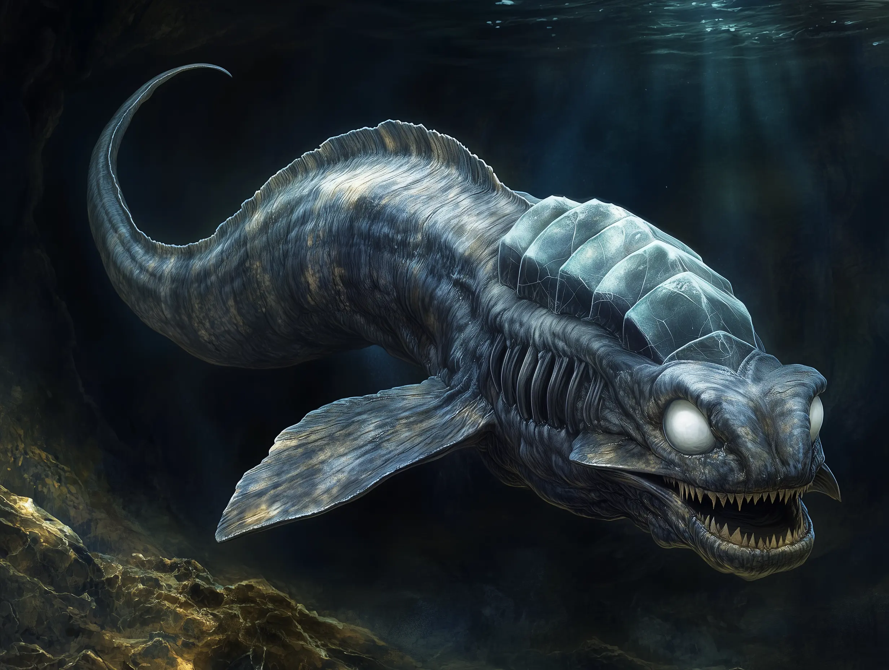

# Black Loch Keelhauler

<link rel="stylesheet" href="../drow_theme.css">

## Overview
**Type:** Monstrosity  
**Size:** Large  
**Alignment:** Unaligned  
**Habitat:** The Black Loch in the Underdark  

## Description
The Black Loch Keelhauler is a powerful aquatic monstrosity, prized by the corsairs and slavers of the Underdark as a peerless beast of burden. Its long, muscular body and powerful fins allow it to tow vessels weighing several tons for days on end without tiring. A Keelhauler's most distinct feature is the series of bony, hooked ridges that flank its spine. These are not part of its skeleton, but rather growths of dense, flexible cartilage that can be pierced with minimal harm to the creature.

## Behavior
Despite their fearsome appearance, Keelhaulers can be domesticated for use as draft animals, though they remain dangerous and unpredictable. They are curious creatures that will often surface to investigate boats and their occupants, sometimes lunging to test reactions.

## Combat Statistics

> **Black Loch Keelhauler**
> *Large monstrosity, unaligned*
> 
> **Armor Class** 15 (natural armor)
> **Hit Points** 126 (12d10 + 60)
> **Speed** 0 ft., swim 50 ft.
> 
> | STR     | DEX     | CON     | INT     | WIS     | CHA     |
> |---------|---------|---------|---------|---------|---------|
> | 20 (+5) | 10 (+0) | 20 (+5) | 5 (-3)  | 12 (+1) | 7 (-2)  |
> 
> **Senses** darkvision 60 ft., passive Perception 11
> **Languages** understands commands in Orcish but can't speak
> **Challenge** 5 (1,800 XP)
> 
> **Amphibious.** The Keelhauler can breathe air and water.
> 
> **Beast of Burden.** The Keelhauler is considered to be one size larger for the purpose of determining its carrying capacity.
> 
> **Tamed Nature (Tamed Only).** A tamed Keelhauler is indifferent to humanoids it doesn't perceive as a threat. It will not attack a creature that falls into the water unless commanded to or if the creature attacks it first.

### Actions

> **Crushing Bite.** *Melee Weapon Attack:* +8 to hit, reach 5 ft., one creature. *Hit:* 16 (2d10 + 5) piercing damage.
> 
> **Tail Slam.** *Melee Weapon Attack:* +8 to hit, reach 10 ft., one creature. *Hit:* 12 (2d6 + 5) bludgeoning damage, and the target must succeed on a DC 16 Strength saving throw or be knocked prone.

## As Draft Animals
When properly trained and harnessed, Keelhaulers can tow vessels across the Black Loch for hours without tiring. They require experienced handlers like Borok the Silent who understand their temperaments and needs. The heavy leather harnesses pierce their dorsal ridges but don't seem to cause lasting harm.

## Notable Features
- Rows of dagger-like teeth
- Ability to maintain steady pace for extended periods
- Respond to specific whistles and commands from trained handlers
- Naturally curious but potentially deadly
- Prefer to circle and investigate before attacking