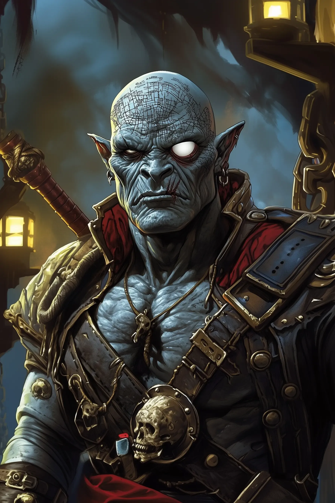

# Borok the Silent - Orog Ferryman of the Black Loch

<link rel="stylesheet" href="../drow_theme.css">

## Overview
**Name:** Borok the Silent  
**Race:** Orog  
**Role:** Professional ferryman and captain of the *Silent Keel*  
**Affiliation:** Independent corsair operating on the Black Loch  

**Quote:** *"Coin speaks. You don't."*

## Description
Borok is a massive Orog, even larger than most of his kind, with broad, powerful shoulders and skin the color of wet slate. His face is a mask of scars, and one eye is a milky, blind white.

His most striking feature is the tapestry of tattoos covering his bald scalp and arms. They are not random tribal markings, but a chaotic, overlapping maze of lines and symbols that form a detailed, stylized chart of the Black Loch's secret routes and dangers. He is a living map, a fact he guards as his most valuable secret.

## Personality
Borok is taciturn to a fault, but his silence hides an intense, calculating focus. He is a pragmatic professional, but also a patient artist. During quiet moments, he can be seen working on a massive piece of leviathan bone scrimshaw, his huge hands carving delicate, intricate scenes with a small, sharp knife. He is a survivor, a cartographer, and an artist in a world that only values his strength.

## The Silent Keel
Borok's vessel is a long, flat-bottomed Underdark skiff, approximately 30 feet long and 8 feet at its widest point, constructed from dark, resin-strengthened petrified wood that muffles sound.

- **Capacity:** Comfortably carries up to 10 medium creatures and their gear
- **Propulsion:** Twin Black Loch Keelhauler eels, massive 30-foot serpentine creatures
- **Design:** Open-topped vessel built for endurance and stealth, not comfort
- **Crew:** Two Grimlock crewmen known as "The Branded"

## Professional Code
- Values silver and silence in equal measure
- Requires exact passphrases for boarding
- Contract is for passage, not protection in battle
- Communicates primarily through gestures and meaningful looks
- Maintains professional pride in completing jobs properly

## Skills & Abilities
- Master navigator of the Black Loch's treacherous waters
- Expert at avoiding patrols and dangerous areas
- Skilled scrimshaw artist
- Proficient with his anchor-shaped greataxe "Bilge-Axe"
- Living repository of secret routes and safe passages

## The Branded Crew
Borok's crew consists of two gaunt, powerful Grimlocks marked with his Corsair insignia seared into their backs. They are mute, communicating only through gestures, and are fanatically loyal out of fear. They will fight to defend the boat but will not leave it.

## Combat Statistics

> **Borok the Silent**
> *Medium humanoid (orog), neutral evil*
> 
> **Armor Class** 18 (plate armor)
> **Hit Points** 60 (7d8 + 28)
> **Speed** 30 ft.
> 
> | STR     | DEX     | CON     | INT     | WIS     | CHA     |
> |---------|---------|---------|---------|---------|---------|
> | 19 (+4) | 12 (+1) | 18 (+4) | 12 (+1) | 14 (+2) | 12 (+1) |
> 
> **Saving Throws** Str +6, Con +6
> **Skills** Athletics +6, Intimidation +3, Perception +4, Survival +4
> **Senses** darkvision 120 ft., passive Perception 14
> **Languages** Common, Orc, Undercommon
> **Challenge** 3 (700 XP)
> 
> **Aggressive.** As a bonus action on his turn, Borok can move up to his speed toward a hostile creature that he can see.
> 
> **Proficient Navigator.** Borok adds double his proficiency bonus (+4) to any ability check he makes to pilot a water vehicle or avoid getting lost while on the Black Loch.

### Actions

> **Multiattack.** Borok makes two attacks with his Bilge-Axe.
> 
> **Bilge-Axe (Greataxe).** *Melee Weapon Attack:* +6 to hit, reach 5 ft., one target. *Hit:* 10 (1d12 + 4) slashing damage. This custom axe is shaped like a sharpened ship's anchor.
> 
> **Javelin.** *Melee or Ranged Weapon Attack:* +6 to hit, reach 5 ft. or range 30/120 ft., one target. *Hit:* 7 (1d6 + 4) piercing damage.

## Relationships
- **Fadda Brinebless:** Tolerates and secretly appreciates his goblin first mate's superstitious practices
- **House Vaerixas:** Accepts contracts from various houses but maintains independence
- **The Black Loch:** Respects and understands the lake's dangers better than most

## Current Activities
Operates regular ferry services across the Black Loch for those who can pay his price and provide proper authentication. Known for successful completion of dangerous crossings and maintaining strict neutrality in drow politics.