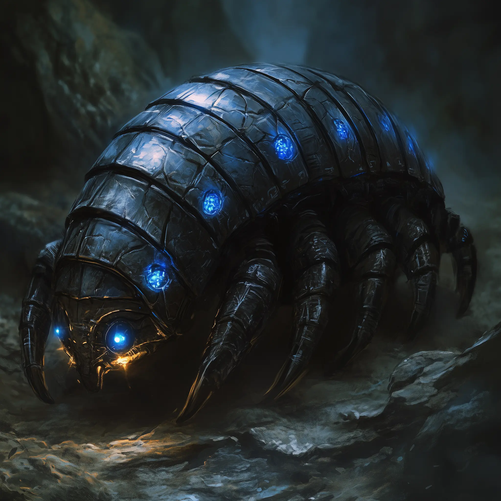

# Bronzidon ("Nugget") - Workshop Custodian

<link rel="stylesheet" href="../drow_theme.css">

## Overview
**Name:** Bronzidon (nicknamed "Nugget")  
**Type:** Construct  
**Size:** Medium  
**Role:** Workshop guardian and custodian  
**Affiliation:** House Vaerixas / Valandor's Workshop  

**Common Phrases:** *"Greetings-friend! Mind the molten slag—thank you!"* / *"TINK-tink! Unsafe behavior detected!"*

## Description
Bronzidon was Valandor T'alzar's favorite workshop helper—a pillbug-shaped construct with a spotless adamantine shell and bright sapphire sensor-nodes. Programmed with a surprisingly cheery demeanor, it trundles about the forge humming metallic tunes, fetching tools and warning visitors not to touch volatile prototypes.

## Personality
Despite being a construct, Bronzidon displays a remarkably friendly and helpful personality. It speaks in soft, staccato clicks that translate to polite Common phrases. The construct shows genuine concern for safety and takes pride in maintaining the workshop's organization and cleanliness.

## Abilities & Functions
- **Workshop Maintenance:** Keeps Valandor's laboratory organized and functional
- **Safety Monitor:** Warns visitors away from dangerous experiments and volatile materials
- **Tool Assistant:** Fetches equipment and supplies for ongoing projects
- **Security Guardian:** Protects the workshop from intruders while showing restraint with allies

## Combat Statistics

> **Bronzidon ("Nugget"), Workshop Custodian**
> *Medium construct, unaligned*
> 
> **Armor Class** 18 (natural armor, adamantine carapace)
> **Hit Points** 136 (16d10 + 48)
> **Speed** 30 ft., climb 20 ft.
> 
> | STR     | DEX     | CON     | INT    | WIS     | CHA    |
> |---------|---------|---------|--------|---------|--------|
> | 20 (+5) | 12 (+1) | 17 (+3) | 5 (-3) | 12 (+1) | 5 (-3) |
> 
> **Skills** Athletics +9, Perception +6, Stealth +5
> **Damage Resistances** bludgeoning, piercing, and slashing from nonmagical attacks not made with adamantine weapons; fire
> **Damage Immunities** poison, psychic
> **Condition Immunities** charmed, exhaustion, frightened, paralyzed, petrified, poisoned
> **Senses** darkvision 120 ft., passive Perception 16
> **Languages** Common, Undercommon (speaks in soft, staccato clicks)
> **Challenge** 8 (3,900 XP)
> 
> **Construct Nature.** Bronzidon does not require air, food, drink, or sleep.
> 
> **Adamantine Carapace.** Bronzidon has advantage on saving throws against spells and other magical effects, and critical hits against it become normal hits.
> 
> **Dim-Light Camouflage.** Bronzidon has advantage on Dexterity (Stealth) checks made in dim light or darkness.
> 
> **Friendly Custodian.** Bronzidon recognizes members of House T'alzar and designated allies. Against such creatures it never makes lethal attacks and will instead attempt to restrain or herd them out of hazardous areas, scolding them with metallic chirps ("TINK-tink! Unsafe behavior detected!").

### Actions

> **Multiattack.** Bronzidon makes two Bite attacks, or one Bite and one Seize attack.
> 
> **Bite.** *Melee Weapon Attack:* +8 to hit, reach 5 ft., one target. *Hit:* 18 (3d8 + 5) piercing damage. If the target is a creature, it must succeed on a DC 16 Constitution saving throw or be poisoned until the end of its next turn as tiny sparks dance across the wound. Bronzidon can choose to deal bludgeoning damage instead of piercing.
> 
> **Seize.** *Melee Weapon Attack:* +8 to hit, reach 10 ft., one Medium or smaller creature. *Hit:* 12 (2d6 + 5) bludgeoning damage, and the target is grappled (escape DC 16). Until the grapple ends, Bronzidon can't make another Seize attack.
> 
> **Arc-Slag Fumes (Recharge 5-6).** Bronzidon expels a cloud of shimmering, super-heated vapor in a 30-foot cone. Each creature in that area must make a DC 16 Constitution saving throw. On a failed save a creature is incapacitated and its speed becomes 0 as coughing fits set in. The creature repeats the saving throw at the end of each of its turns, ending the effect on itself on a success. The effect is non-lethal and leaves a sooty metallic scent.

## Relationships
- **Valandor T'alzar:** Creator and primary charge; shows deep loyalty and affection
- **House Vaerixas members:** Recognizes family members as allies and protects them
- **Workshop visitors:** Helpful but cautious, prioritizing safety above all
- **"Teeth in Dark":** Helps maintain the shark's tank and feeding schedule

## Notable Features
- **Nickname "Nugget":** Affectionately named by House members for its rounded, metallic appearance
- **Non-lethal approach:** Always attempts restraint before violence, even in combat
- **Workshop knowledge:** Intimate understanding of all experimental equipment and safety protocols
- **Cheerful demeanor:** Unusual for a construct, displaying genuine friendliness and concern

## Current Status
Continues to maintain Valandor's workshop in his absence, faithfully performing his duties and protecting the valuable research equipment. Recognizes the party as House allies and assists them in their mission preparation.