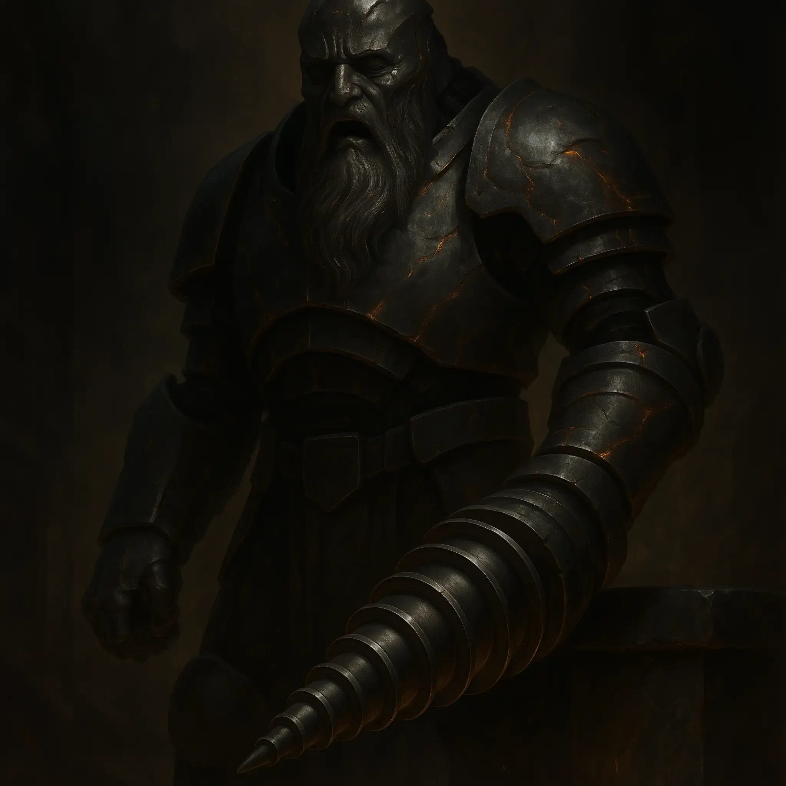

# Black Mithril Screamer

<link rel="stylesheet" href="../../drow_theme.css">

> | **Size** | **Type** | **Alignment** | **Challenge Rating** |
> |----------|----------|---------------|----------------------|
> | Large | construct | unaligned | 6 |

## Core Statistics

> | **Armor Class** | **Hit Points** | **Speed** | **Proficiency Bonus** |
> |-----------------|----------------|-----------|------------------------|
> | 18 (Black Mithril Plating) | 114 (12d10 + 48) | 25 ft. | +3 |

## Ability Scores

> | **STR** | **DEX** | **CON** | **INT** | **WIS** | **CHA** |
> |---------|---------|---------|---------|---------|---------|
> | 20 (+5) | 8 (-1) | 18 (+4) | 3 (-4) | 10 (+0) | 5 (-3) |

## Additional Statistics

**Saving Throws:** STR +8, CON +7

**Senses:** darkvision 120 ft., passive Perception 10

**Languages:** understands Duergar and Drow but can't speak

## Traits

### Psionic Feedback Loop
The screamer is vulnerable to psychic damage. However, whenever it takes psychic damage, its Unstable Matrix trait immediately triggers and its Resonant Scream action is instantly recharged.

### Black Mithril Plating
The screamer has advantage on saving throws against spells and other magical effects.

### Siege Monster
The screamer deals double damage to objects and structures.

### Unstable Matrix
If the screamer takes 20 or more damage in a single round, it must succeed on a DC 10 Wisdom saving throw at the start of its next turn or go berserk. While berserk, it must use its action to make a Multiattack against the nearest creature it can see. It can repeat the saving throw at the end of each of its turns, ending the effect on itself on a success.

## Actions

### Multiattack
The screamer makes two attacks: one with its Mithril Drill and one with its Slam.

### Mithril Drill
Melee Weapon Attack: +8 to hit, reach 10 ft., one target. *Hit:* 2d10+5 piercing.

If the target is a creature, it is grappled (escape DC 16). Until this grapple ends, the target is restrained, and the screamer can't use its drill on another target.

### Slam
Melee Weapon Attack: +8 to hit, reach 5 ft., one target. *Hit:* 2d6+5 bludgeoning.

### Resonant Scream (Recharge 5-6)
Spell: +0 to hit, reach 30-foot cone, Each creature in area. *Hit:* 4d8 thunder.

Each creature in the area must make a DC 15 Constitution saving throw. On a failed save, a creature takes 4d8 thunder damage, is pushed 15 feet away from the screamer, and is knocked prone. On a successful save, the creature takes half as much damage and is not pushed or knocked prone.

## Biography

The Black Mithril Screamer is the terrifying result of House Glutthraz's funding and the duergars' profane craftsmanship. A hulking suit of interlocking black metal plates that glow with faint orange fissures, this construct is built around the tormented soul of a living creature. Its right arm has been replaced with a massive, revolving drill capable of tearing through steel and stone, and its tortured screams can shatter bone. The Black Mithril fused to its chassis makes it incredibly resilient but dangerously unstable.

---

*"Black Mithril Screamer stands ready to serve the interests of their house and the will of the Spider Queen."*