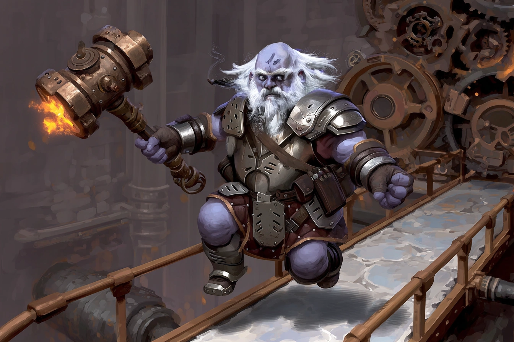

# Chief Engineer Tholdrum "Steam-Heart" Garn

<link rel="stylesheet" href="../../drow_theme.css">

## Combat Statistics

## Biography

Chief Engineer Tholdrum "Steam-Heart" Garn oversees the industrial production of Screamers at the Cinderfork Foundry. With a partially mechanical heart, he views sentient constructs as an engineering challenge to be perfected. His right eye has been replaced with a mechanical monocle that constantly adjusts focus, and steam occasionally hisses from vents in his armor. He carries a heavy wrench that doubles as a mace and speaks in efficient, clipped sentences.

---

*"Chief Engineer Tholdrum "Steam-Heart" Garn stands ready to serve the interests of their house and the will of the Spider Queen."*
