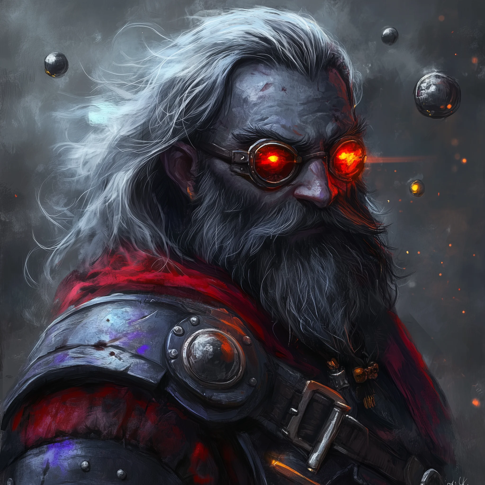

# Chief Researcher Korvun

<link rel="stylesheet" href="../../drow_theme.css">

## Combat Statistics

## Biography

Chief Researcher Korvun is the brilliant mind behind the screamer torment matrices at Cinderfork Foundry. A meticulous duergar with wild, singed eyebrows and a perpetually distracted expression, he treats the creation of these abominations as pure science. He keeps detailed notes on pain thresholds and soul-binding techniques, viewing each screaming construct as a data point in his grand experiment. Despite his clinical approach to horror, he maintains a surprisingly warm relationship with his wife, Alyxina.

---

*"Chief Researcher Korvun stands ready to serve the interests of their house and the will of the Spider Queen."*
