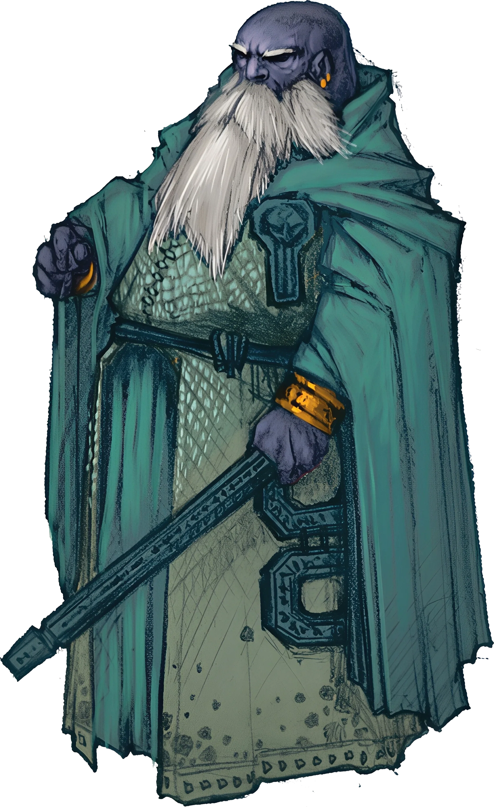

# Director Koldar

<link rel="stylesheet" href="../../drow_theme.css">

## Combat Statistics

## Biography

Director Koldar runs the Cinderfork Foundry with ruthless efficiency, treating both workers and screamers as resources to be optimized. A stern duergar with iron-gray beard braided with small gears, he wears a coat covered in pockets filled with ledgers and production schedules. He speaks in terms of quotas and deadlines, showing emotion only when production targets are missed or exceeded.

---

*"Director Koldar stands ready to serve the interests of their house and the will of the Spider Queen."*
