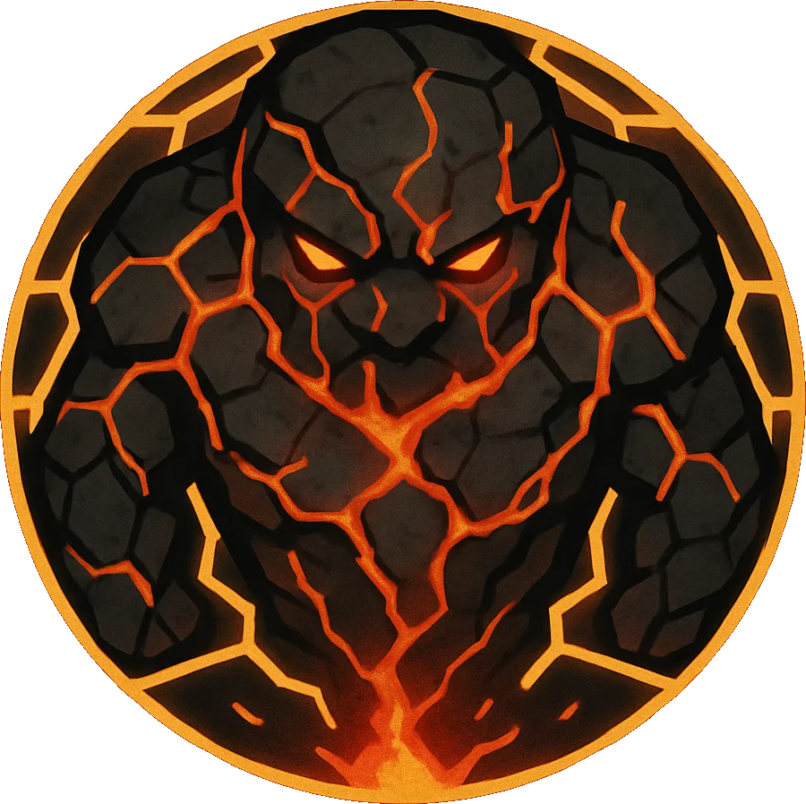

# Geothermal Elemental

<link rel="stylesheet" href="../../drow_theme.css">

## Combat Statistics

## Biography

The Bound Geothermal Elemental is a creature of living magma and stone, enslaved by the duergar artificers to power the foundry's forges. Chains of enchanted adamantine bind it to the facility's core, where its immense heat is channeled into the screamer production process. It constantly struggles against its bonds, causing occasional tremors throughout the complex. The elemental understands its captivity and burns with hatred for its captors.

---

*"Geothermal Elemental stands ready to serve the interests of their house and the will of the Spider Queen."*
