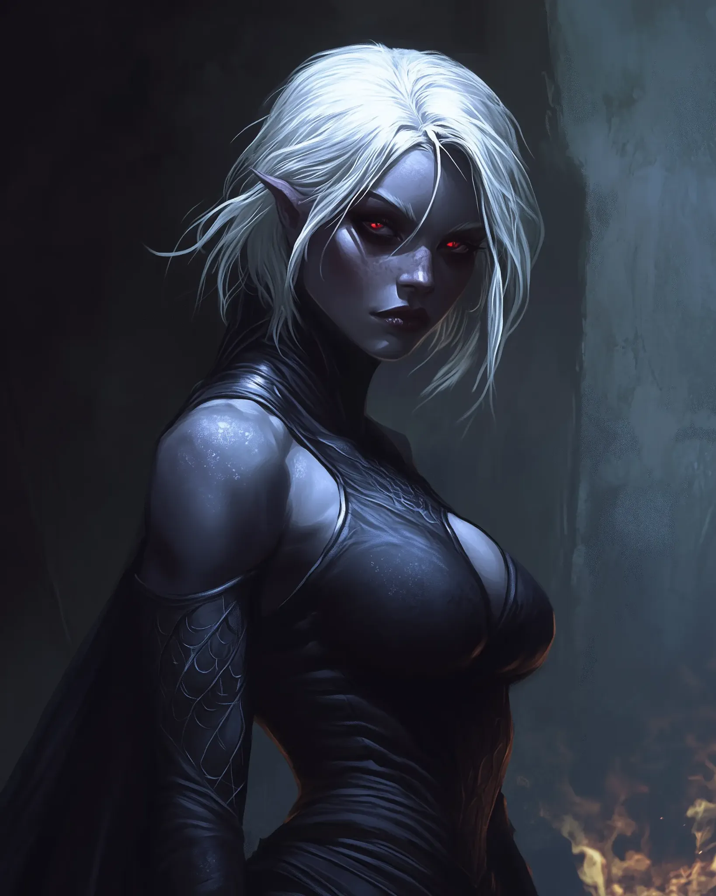

# Liaison Malexa

<link rel="stylesheet" href="../../drow_theme.css">

## Combat Statistics

## Biography

Liaison Malexa serves as the primary contact between House Glutthraz and the Cinderfork Foundry. This elegant drow maintains an office within the facility, though she clearly finds the industrial environment distasteful. She dresses in fine spider silk robes that seem perpetually clean despite the foundry's grime, and speaks with the cultured tones of high drow society. Her role is to ensure the foundry's output meets House Glutthraz's specifications and payment flows smoothly.

---

*"Liaison Malexa stands ready to serve the interests of their house and the will of the Spider Queen."*
