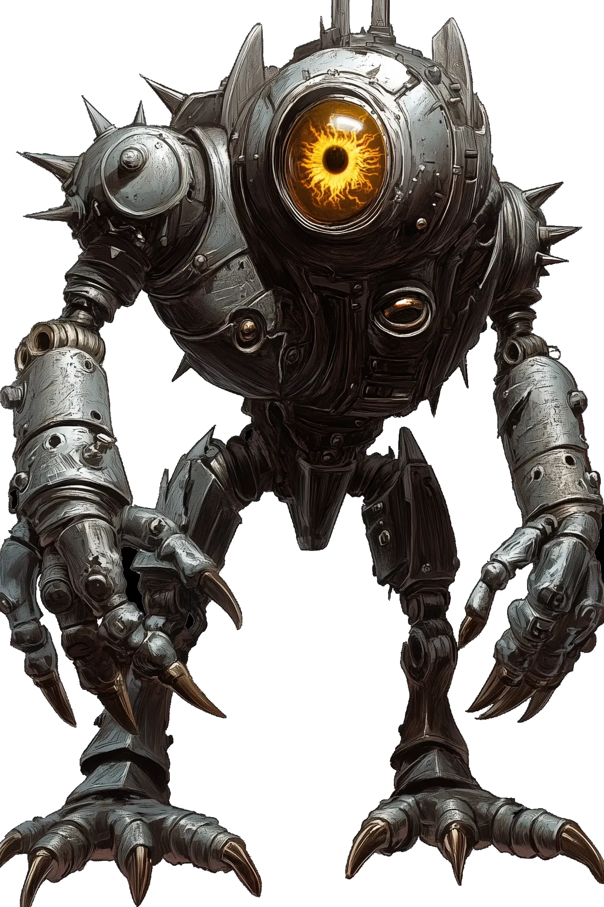

# Scrutinizer

<link rel="stylesheet" href="../../drow_theme.css">

## Combat Statistics

## Biography

The Scrutinizer is a specialized construct designed to monitor and evaluate screamer production quality. This spider-like automaton skitters through the foundry on eight articulated legs, its cluster of crystal eyes recording every detail. It communicates through a series of clicks and whirs that the foundry workers have learned to interpret. Unlike the screamers, the Scrutinizer shows no signs of consciousness, operating purely on programmed directives.

---

*"Scrutinizer stands ready to serve the interests of their house and the will of the Spider Queen."*
