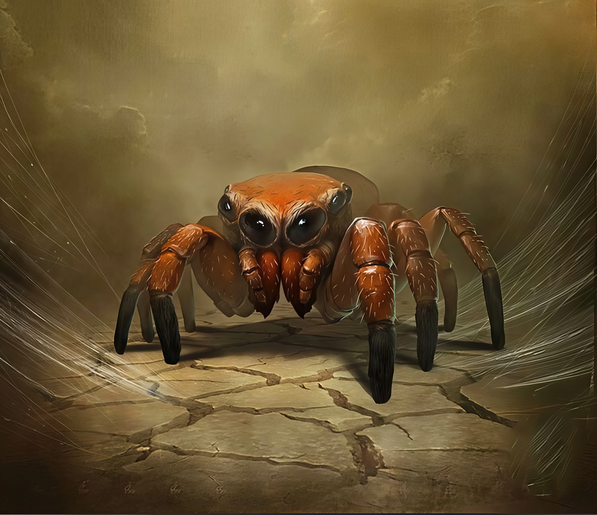

# Skitter

<link rel="stylesheet" href="../../drow_theme.css">

## Combat Statistics

---

## Traits

### Spider Climb
Skitter can climb difficult surfaces, including upside down on ceilings, without needing to make an ability check.

### Web Walker
Skitter ignores movement restrictions caused by webbing.

### Domesticated
Skitter is a loyal house pet and is not aggressive. It will only attack if it perceives a direct, physical threat to Korvun or Alyxina. It often behaves like a large, curious dog.

### Affectionate Nuzzle
As an action, Skitter can nuzzle a friendly creature. The creature must succeed on a DC 10 Dexterity saving throw or have one of their limbs (at the DM's choice) covered in a thin, harmless layer of sticky webbing that can be removed with an action. Skitter does this as a sign of affection.

## Biography

Skitter is a large, domesticated cave spider with an unusually friendly disposition and large, expressive eyes. Korvun and Alyxina raised him from an egg, and he behaves much like a loyal, well-trained dog. He can be found scuttling around their quarters in the Research Cottage, often curling up by the hearth or waiting by the door for his masters to return. He chitters happily when given attention and has a habit of affectionately nuzzling people, sometimes leaving them covered in a bit of harmless webbing.

---

*"Skitter stands ready to serve the interests of their house and the will of the Spider Queen."*
