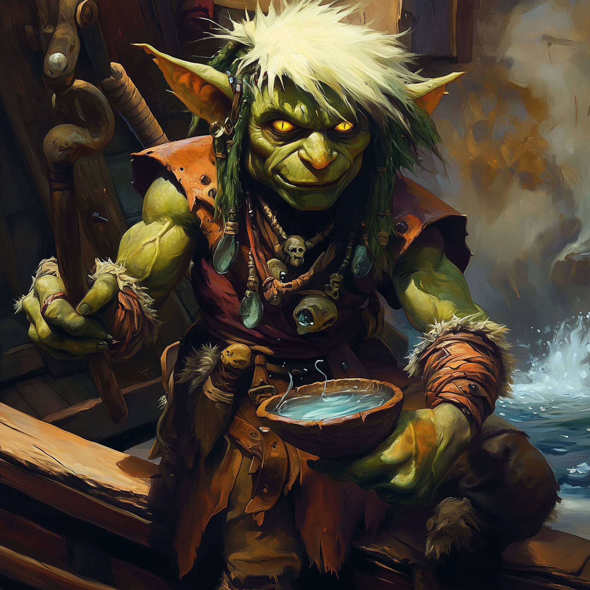

# Fadda Brinebless - Goblin Priest & First Mate

<link rel="stylesheet" href="../drow_theme.css">

## Overview
**Name:** Fadda Brinebless  
**Race:** Goblin  
**Role:** First mate, ship's priest, and superstitious guide aboard the *Silent Keel*  
**Affiliation:** Borok the Silent's ferry crew  

**Common Phrases:** *"Deep Black guard da iron worm, yah!"* / *"Bless-bless, deep water keep ya bones un-sunk!"*

## Description
A small, wiry goblin with bright yellow eyes and weathered hands that shake slightly when nervous. Fadda wears salt-stained studded leather and carries a trident slung across his back. His twenty years on the Black Loch have left him with countless stories and a deep, superstitious reverence for the dark waters.

## Personality
Fadda speaks in a high-pitched pidgin blend of goblin, undercommon, and his own invented words. Despite his cheerful demeanor and constant rituals, there's genuine wisdom and fear in his old eyes. He's seen the lake claim many souls and believes his superstitious practices are all that keep the crew safe.

## Religious Practices
- **Blessing Rituals:** Sprinkles loch water on passengers and vessel
- **Salt Ceremonies:** Distributes blessed salt for "grip-grip" and protection
- **The Whisperer's Ritual:** Complex ceremony involving coins, black brine, and pale lichen
- **Daily Prayers:** Constant litanies to appease the "Deep Black"

## Role on the Ferry
- **First Mate:** Assists with navigation and crew coordination
- **Spiritual Protection:** Performs protective rituals throughout voyages
- **Passenger Relations:** Explains (in his unique way) the lake's dangers
- **Morale Officer:** Uses humor and superstition to manage fear

## Combat Statistics

## Relationships
- **Borok the Silent:** Deep mutual respect hidden beneath surface dynamics
- **The Keelhaulers:** Treats the massive eels like dangerous but beloved pets
- **The Branded:** Works alongside the Grimlock crew with practiced efficiency
- **Passengers:** Genuinely cares about their safety, if eccentrically

## Notable Quotes & Wisdom
- *"Lake ain't just water, ya know. It's got memories, grudges. It listens...sometimes answers."*
- *"Had a wizard aboard once, proud fool thought the Loch's secrets were his for the takin'. Loch kept 'im instead."*
- *"Fadda always lose dice-game. But losing bring good sailing luck, yah? Is fair trade with Deep Black!"*
- *"Iron worms got their own ways. Respect 'em, they respect you back. Most times."*

## Rituals & Superstitions
- Must bless all passengers before departure
- Tosses coins to appease water spirits
- Sings haunting melodies to calm the waters
- Never speaks ill of the lake while aboard
- Maintains that deliberate losses bring good fortune

## Skills & Knowledge
- Twenty years of Black Loch navigation experience
- Encyclopedic knowledge of lake legends and dangers
- Skilled at reading the water's moods
- Expert at the Whisperer's protective ritual
- Surprisingly effective at crew coordination despite eccentric manner

## Current Activities
Continues to serve as Borok's first mate, maintaining the spiritual and practical well-being of the *Silent Keel* and its passengers. His rituals, while seemingly nonsensical, have kept the vessel safe through countless dangerous crossings.

## Equipment
- **Loch-Blessed Trident:** +1 magical trident that glows faintly blue underwater
- **Navigator's Compass of the Deep:** Always points toward the nearest safe harbor
- **Pouch of Sacred Loch Salt:** Contains blessed salt for 10 ritual blessings
- **Bone Dice Set:** Carved from keelhauler bones for gambling and divination