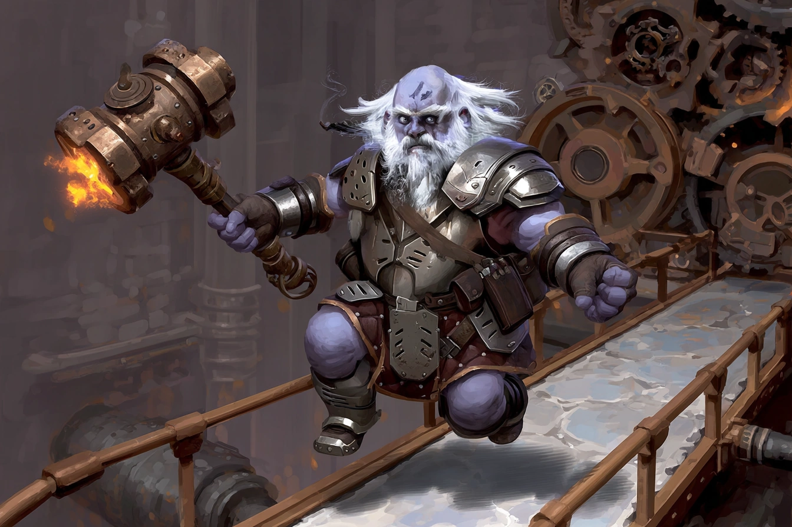

# Chief Engineer Tholdrum "Steam-Heart" Garn

<link rel="stylesheet" href="../drow_theme.css">

> | **Size** | **Type** | **Alignment** | **Challenge Rating** |
> |----------|----------|---------------|----------------------|
> | Medium | humanoid (duergar) | lawful evil | 4 |

## Core Statistics

> | **Armor Class** | **Hit Points** | **Speed** | **Proficiency Bonus** |
> |-----------------|----------------|-----------|------------------------|
> | 16 (Reinforced Breastplate) | 75 (10d8 + 30) | 25 ft. | +2 |

## Ability Scores

> | **STR** | **DEX** | **CON** | **INT** | **WIS** | **CHA** |
> |---------|---------|---------|---------|---------|---------|
> | 16 (+3) | 12 (+1) | 17 (+3) | 14 (+2) | 12 (+1) | 11 (+0) |

## Additional Statistics

**Saving Throws:** CON +6, INT +5

**Skills:** Athletics +6, History +5, Perception +3, Smiths_Tools +8

**Senses:** darkvision 120 ft., passive Perception 13

**Languages:** Dwarvish, Undercommon, Common

## Traits

### Duergar Resilience
Tholdrum has advantage on saving throws against poison, spells, and illusions, as well as to resist being charmed or paralyzed.

### Sunlight Sensitivity
While in sunlight, Tholdrum has disadvantage on attack rolls and on Wisdom (Perception) checks that rely on sight.

### Innate Spellcasting (Psionics)
Tholdrum's innate spellcasting ability is Intelligence (spell save DC 13). He can innately cast the following spells, requiring no material components:

1/day each: Enlarge/Reduce (self only, Enlarge option only), Invisibility (self only)

### Steam-Heart Engineer
Tholdrum has advantage on ability checks made to operate, repair, or sabotage mechanical devices and forge machinery.

## Actions

### Multiattack
Tholdrum makes two attacks with his Steam Hammer or uses Steam Hammer once and Pressure Vent once, if available.

### Steam Hammer
Melee Weapon Attack: +6 to hit, reach 5 ft., one target. *Hit:* 1d8+4 bludgeoning plus 1d6 fire.

A heavy warhammer fitted with a pressurised heating core. On a hit, the target takes bludgeoning plus fire damage.

### Pressure Vent (Recharge 5-6)
Special: +0 to hit, reach 15-ft. cone, each creature in area. *Hit:* 4d6 fire.

Tholdrum releases a blast of scalding steam from a shoulder-mounted valve. Creatures that fail the save take fire damage and are pushed 10 ft. away. On a success, they take half damage and aren't pushed. The area becomes lightly obscured until the start of Tholdrum's next turn.

## Bonus Actions

### Overcharge Valve (1/Day)
Tholdrum superheats the core in his armour. Until the start of his next turn, he has resistance to all damage except psychic, and his Steam Hammer deals an extra 1d6 fire damage. At the end of the duration, he takes 5 force damage.

## Reactions

### Gear Parry
When a creature Tholdrum can see hits him with a melee attack, he can add +2 to his AC against that attack, potentially causing it to miss.

## Biography

Tholdrum Garn earned the nickname "Steam-Heart" after a near-fatal boiler explosion left a lattice of burn-scars across his chest and fused a pressure-valve harness permanently into his armour. Raised in Clan Fire-Beard's lower forges, he rose through grit and innovation to become the chief engineer of Cinderfork's geothermal plant. Tholdrum cares little for politics—his loyalty is to the machinery that keeps the foundry beating. He despises Korvun's "theory-first" meddling, believing real progress is forged with sweat and steel, not chalkboards.

Though cruel in typical duergar fashion, he is fiercely protective of his crew; hidden in an iron locket he carries are charcoal sketches of his twin broodlings, proof that even a heart of steam still pumps blood. If convinced the foundry is doomed, he will bargain for his life—and theirs—offering access codes and shutdown procedures in exchange for safe passage.

---

*"Chief Engineer Tholdrum "Steam-Heart" Garn stands ready to serve the interests of their house and the will of the Spider Queen."*