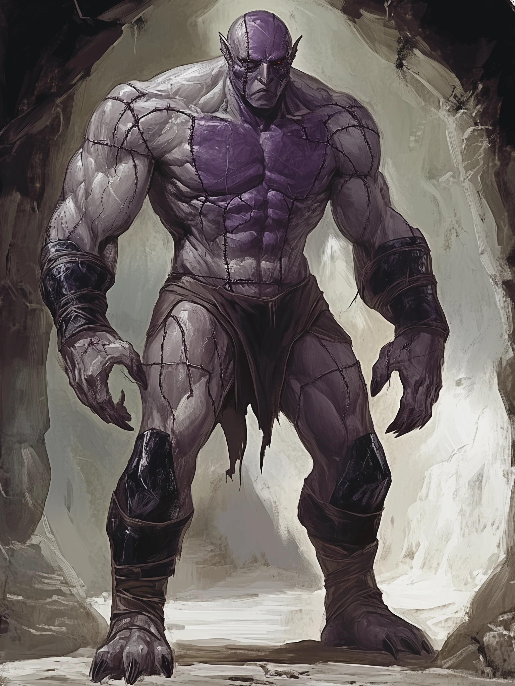

# Grumble

<link rel="stylesheet" href="../drow_theme.css">

> | **Size** | **Type** | **Alignment** | **Challenge Rating** |
> |----------|----------|---------------|----------------------|
> | Medium | construct | lawful neutral | 5 |

## Core Statistics

> | **Armor Class** | **Hit Points** | **Speed** | **Proficiency Bonus** |
> |-----------------|----------------|-----------|------------------------|
> | 15 (natural armor with adamantine plating) | 93 (11d8 + 44) | 30 ft. | +2 |

## Ability Scores

> | **STR** | **DEX** | **CON** | **INT** | **WIS** | **CHA** |
> |---------|---------|---------|---------|---------|---------|
> | 19 (+4) | 9 (-1) | 18 (+4) | 16 (+3) | 10 (+0) | 8 (-1) |

## Additional Statistics

**Skills:** Arcana +6, History +6, Investigation +6, Athletics +7

**Senses:** darkvision 60 ft., passive Perception 10

**Languages:** Common, Undercommon

## Traits

### Berserk
Whenever Grumble starts his turn with 40 hit points or fewer, roll a d6. On a 6, Grumble goes berserk. On each of his turns while berserk, Grumble attacks the nearest creature he can see. If no creature is near enough to move to and attack, Grumble attacks an object, with preference for an object smaller than himself. Once Grumble goes berserk, he continues to do so until he is destroyed or regains all his hit points.

### Aversion to Fire
If Grumble takes fire damage, he has disadvantage on attack rolls and ability checks until the end of his next turn.

### Immutable Form
Grumble is immune to any spell or effect that would alter his form.

### Lightning Absorption
Whenever Grumble is subjected to lightning damage, he takes no damage and instead regains a number of hit points equal to the lightning damage dealt.

### Magic Resistance
Grumble has advantage on saving throws against spells and other magical effects.

### Intelligent Construct
Unlike typical flesh golems, Grumble possesses a formidable, if profoundly cynical, intellect (a 'brain the size of a planet,' he might gloomily assert) and a distinct personality. He is capable of complex communication, creative problem-solving (usually to point out the futility of the problem or the intellectual inferiority of the plan), and expressing his existential despair with cutting wit and a surprisingly vast vocabulary.

### Pessimistic Commentary
Grumble frequently makes dour, sarcastic, and highly articulate observations about the utter pointlessness of most situations. These comments, delivered in his characteristic monotone, can sometimes, quite by accident from his perspective, provide an uncomfortably astute insight into problems, giving allies advantage on one Intelligence-based skill check per day when Grumble deigns to share his 'helpful' perspective on impending doom or wasted effort. This is particularly true for matters of Arcana, History, or Investigation, fields in which his intellect far outstrips his assigned duties.

## Actions

### Multiattack
The golem makes two slam attacks.

### Slam
Melee: +7 to hit, reach 5 ft., one target. *Hit:* 2d8+4 bludgeoning.

### Vicious Mockery (Cantrip)
Spell: +0 to hit, one target. *Hit:* 2d4 psychic.

On a failed save, the target takes psychic damage and has disadvantage on its next attack roll.

## Bonus Actions

### Sarcastic Observation (Bonus Action)
Grumble makes a particularly cutting remark about the current dire situation or an enemy's obvious failings, perhaps referencing an obscure historical precedent for such folly. Choose one enemy within 30 feet that can hear him. That creature must make a DC 12 Wisdom saving throw or be momentarily distracted by the sheer accuracy of his pessimism, giving the next attack against it advantage.

## Reactions

### Defeatist Deflection
When an ally within 30 feet is attacked, Grumble can mutter something profoundly pessimistic about their chances (e.g., 'Oh, don't bother dodging, it'll only prolong the inevitable sense of disappointment, much like my continued existence in this capacity'). The sheer unexpectedness of this advice somehow helps them. The ally gains +2 AC against that attack.

## Biography

Grumble is an intelligent flesh golem assembled by Matron Severine to serve House T'alzar. He is dour, sarcastic, and prone to dry, pessimistic commentary (think Marvin the Paranoid Android). He obeys the party leader's commands, but rarely cheerfully. His loyalty is functional, not emotional, and he often complains about the indignities of his existence.

---

*"Grumble stands ready to serve the interests of their house and the will of the Spider Queen."*