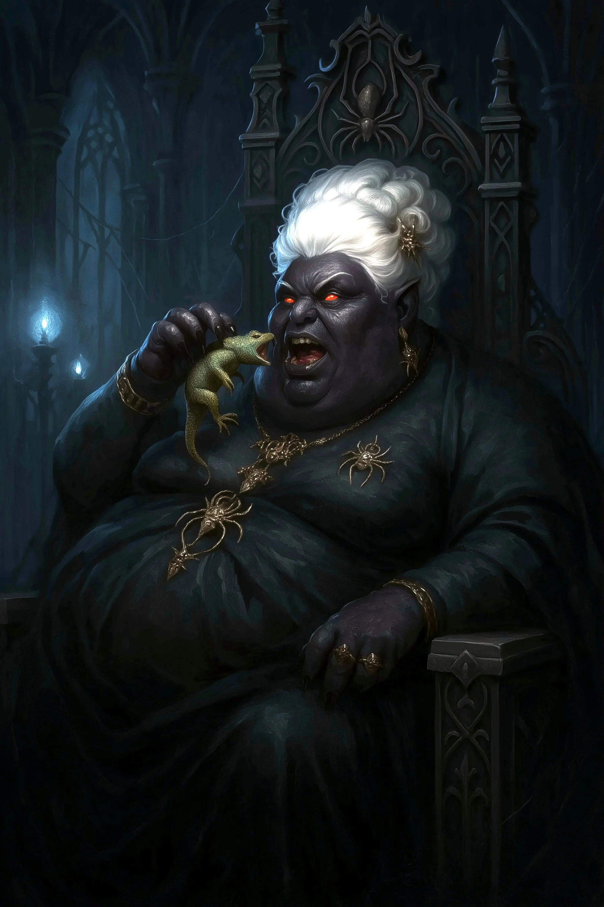

# Matron Mother Zephyra Glutthraz

<link rel="stylesheet" href="../drow_theme.css">

> | **Size** | **Type** | **Alignment** | **Challenge Rating** |
> |----------|----------|---------------|----------------------|
> | Medium | humanoid (drow) | lawful evil | 14 |

## Core Statistics

> | **Armor Class** | **Hit Points** | **Speed** | **Proficiency Bonus** |
> |-----------------|----------------|-----------|------------------------|
> | 19 (natural armor, magical vestments) | 165 (22d8 + 77) | 30 ft., fly 60 ft. (magical) | +5 |

## Ability Scores

> | **STR** | **DEX** | **CON** | **INT** | **WIS** | **CHA** |
> |---------|---------|---------|---------|---------|---------|
> | 14 (+2) | 18 (+4) | 17 (+3) | 16 (+3) | 19 (+4) | 22 (+6) |

## Additional Statistics

**Saving Throws:** WIS +10, CHA +12

**Skills:** Deception +12, Insight +10, Intimidation +18, Perception +10, Religion +9

**Senses:** darkvision 120 ft., truesight 60 ft., passive Perception 20

**Languages:** Common, Elvish, Undercommon, Abyssal, telepathy 120 ft.

## Traits

### Fey Ancestry
Zephyra has advantage on saving throws against being charmed, and magic can't put her to sleep.

### Sunlight Sensitivity
While in sunlight, Zephyra has disadvantage on attack rolls, as well as on Wisdom (Perception) checks that rely on sight.

### Spellcasting
Zephyra is a 15th-level spellcaster. Her spellcasting ability is Charisma (spell save DC 20, +12 to hit with spell attacks). She has the following spells prepared:

Cantrips (at will): eldritch blast, mage hand, minor illusion, prestidigitation, thaumaturgy, toll the dead
1st level (4 slots): charm person, command, detect magic, shield
2nd level (3 slots): detect thoughts, hold person, suggestion
3rd level (3 slots): counterspell, dispel magic, fireball, hypnotic pattern
4th level (3 slots): confusion, dimension door, greater invisibility, wall of fire
5th level (2 slots): dominate person, flame strike, scrying
6th level (1 slot): harm, mass suggestion
7th level (1 slot): fire storm, plane shift
8th level (1 slot): feeblemind, power word stun

### Legendary Resistance (3/Day)
If Zephyra fails a saving throw, she can choose to succeed instead.

### Magic Resistance
Zephyra has advantage on saving throws against spells and other magical effects.

### Resource Monopolist
Zephyra can command vast resources. Once per day, she can summon 2d4 drow elite warriors or 1d2 drow mages as reinforcements (they arrive in 1d4 rounds).

### Aura of Dominance
Hostile creatures within 30 feet of Zephyra have disadvantage on saving throws against being charmed or frightened. Allied creatures within 30 feet have advantage on saving throws against being charmed or frightened.

### Spider Queen's Blessing
Zephyra can walk on walls and ceilings as if they were normal ground. She can also cast spider climb at will without expending a spell slot.

## Spellcasting

**Spellcasting:** Charisma-based, 15th level caster
**Spell Save DC:** 20, **Spell Attack Bonus:** +12

## Actions

### Multiattack
Zephyra can cast a spell and make one weapon attack, or make two weapon attacks, or cast two spells of 3rd level or lower.

### Scourge of Fangs
Melee: +10 to hit, reach 10 ft., one target. *Hit:* 2d6+4 slashing plus 3d6 necrotic.

On a hit, target must succeed on a DC 20 CON save or be poisoned for 1 minute.

### Hand Crossbow
Ranged: +10 to hit, range 30/120 ft., one target. *Hit:* 1d6+4 piercing plus 4d6 poison.

On a hit, target must succeed on a DC 18 CON save for half poison damage.

### Crushing Authority (Recharge 5-6)
Zephyra unleashes her overwhelming presence in a 30-foot radius. All creatures of her choice in the area must make a DC 20 Wisdom saving throw. On a failure, they take 21 (6d6) psychic damage and are stunned until the end of their next turn. On a success, they take half damage and are not stunned.

### Glutthraz's Wealth (1/Day)
Zephyra channels her house's vast resources into a devastating display. She creates a 20-foot radius area of difficult terrain centered on a point within 60 feet. The area fills with summoned treasure, weapons, and constructs that attack indiscriminately. Creatures starting their turn in the area take 14 (4d6) bludgeoning damage (DC 20 Dex save for half). The effect lasts for 1 minute.

## Bonus Actions

### Eldritch Blast
Zephyra casts eldritch blast as a bonus action, making three separate attacks (+12 to hit, 120 ft. range, 1d10 + 6 force damage each).

### Command Resources
Zephyra can command any allied creature within 60 feet to move up to its speed or take the Dash action without provoking opportunity attacks.

## Reactions

### Counterspell
When a creature casts a spell within 60 feet, Zephyra can cast counterspell using a spell slot.

### Shield
When hit by an attack or targeted by magic missile, Zephyra can cast shield to gain +5 AC until the start of her next turn.

## Biography

Matron Mother Zephyra Glutthraz is the ruthless head of House Glutthraz, the resource monopolist house that has systematically crushed House T'alzar's economic power. Where Severine T'alzar is a subtle chess master, Zephyra is overwhelming force personified - she believes that sufficient resources and power can solve any problem. Her house controls critical supply lines, mining operations, and trade routes throughout the Underdark. She views House T'alzar's resistance as an irritating inefficiency to be eliminated. Zephyra's power comes not just from her personal magical abilities, but from her house's vast accumulated wealth and the armies it can buy. She sees the surface world as another resource to be claimed and exploited, making the mission to Phandalin a direct threat to her expanding dominion.

---

*"Matron Mother Zephyra Glutthraz stands ready to serve the interests of their house and the will of the Spider Queen."*