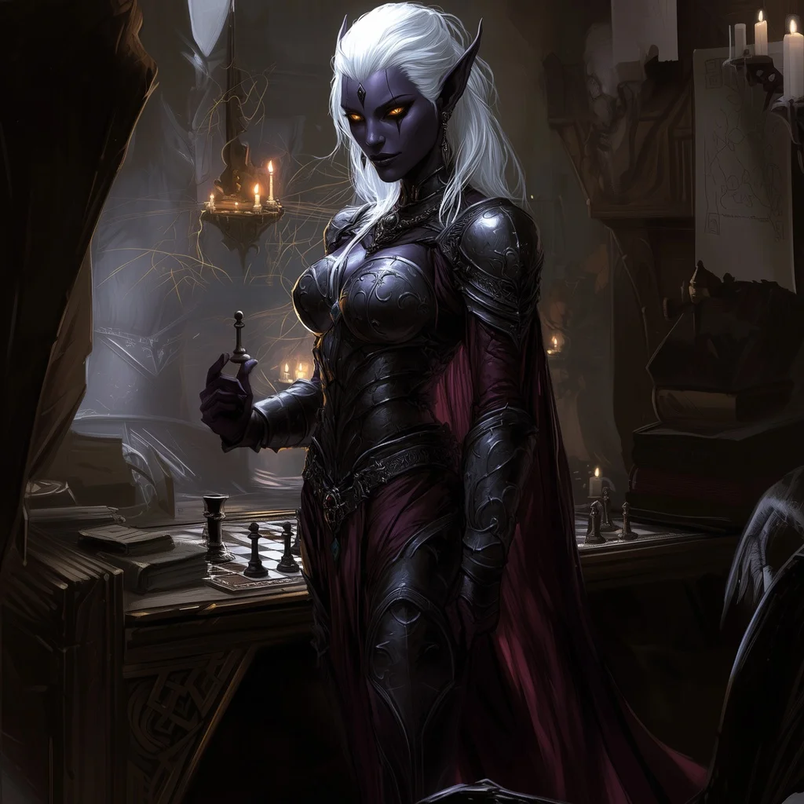

# Matron Severine T'alzar

<link rel="stylesheet" href="../drow_theme.css">

> | **Size** | **Type** | **Alignment** | **Challenge Rating** |
> |----------|----------|---------------|----------------------|
> | Medium | humanoid (drow) | lawful evil | 1 |

## Core Statistics

> | **Armor Class** | **Hit Points** | **Speed** | **Proficiency Bonus** |
> |-----------------|----------------|-----------|------------------------|
> | 17 (+1 Adamantine Mithril Breastplate) | 85 (10d6 + 3d10 + 26) | 30 ft. | +5 |

## Ability Scores

> | **STR** | **DEX** | **CON** | **INT** | **WIS** | **CHA** |
> |---------|---------|---------|---------|---------|---------|
> | 10 (+0) | 14 (+2) | 14 (+2) | 20 (+5) | 16 (+3) | 16 (+3) |

## Additional Statistics

**Saving Throws:** INT +10, WIS +8

**Skills:** Deception +8, History +10, Insight +8, Intimidation +8, Investigation +10, Perception +8, Persuasion +8

**Senses:** darkvision 120 ft., passive Perception 18

**Languages:** Common, Elvish, Undercommon, Draconic, Dwarvish

## Equipment

### +1 Adamantine Mithril Breastplate of Mastermind's Contingency
Once per long rest: Cast Misty Step, become invisible until start of next turn.

### Tactical Precision Rapier +1
Permanent poison coating (DC 15 Con save: 2d4 poison + disadvantage on next attack/save). Advantage on opportunity attacks. Free maneuver on opportunity attack hits.

### Arcane Grimoire +2
+2 to spell attacks and spell save DC. Functions as a spellbook.

### Crystal Ball of Mind Reading
Allows for scrying and casting Detect Thoughts.

### T'alzar Signet of Command
3 charges: Cast Sending to T'alzar members, +2 initiative to allies, advantage on social checks vs. house members.

## Traits

### Fey Ancestry
Severine has advantage on saving throws against being charmed, and magic can't put her to sleep.

### Sunlight Sensitivity
While in sunlight, Severine has disadvantage on attack rolls, as well as on Wisdom (Perception) checks that rely on sight.

### Drow Magic
Can cast Dancing Lights, Faerie Fire, and Darkness once per day each.

### Spellcasting (Wizard)
Severine is a 10th-level spellcaster. Her spellcasting ability is Intelligence (spell save DC 20, +12 to hit with spell attacks, both boosted by her Arcane Grimoire). She has the following wizard spells prepared:

Cantrips (at will): Fire Bolt, Mage Hand, Minor Illusion, Prestidigitation
1st level (4 slots): Shield, Magic Missile, Detect Magic, Comprehend Languages
2nd level (3 slots): Misty Step, Hold Person, Detect Thoughts, Web
3rd level (3 slots): Counterspell, Fireball, Hypnotic Pattern
4th level (3 slots): Polymorph, Greater Invisibility, Arcane Eye
5th level (2 slots): Wall of Force, Dominate Person

### Arcane Recovery
Once per day after a short rest, she can recover spell slots with a combined level equal to half her wizard level (5).

### Portent (2/day)
At the end of a long rest, roll 2d20 and record the numbers. She can replace any attack roll, saving throw, or ability check made by her or a creature she can see with one of these foretelling rolls. She must choose to do so before the roll, and can only use one Portent die per turn.

### Expert Divination
When she casts a divination spell of 2nd level or higher, she regains one expended spell slot of a level lower than the one she cast.

### The Third Eye
As an action, she can gain one of the following benefits for 1 hour: Darkvision 60ft, see invisibility, or read any language.

### Fighting Style: Defense
While wearing armor, she gains a +1 bonus to AC (already included).

### Second Wind
Once per short or long rest, she can use a bonus action to regain 1d10 + 3 hit points.

### Action Surge
Once per short or long rest, she can take one additional action on her turn.

### Combat Superiority
She has 4 superiority dice (d8s). A superiority die is expended when she uses it. She regains all of her expended superiority dice when she finishes a short or long rest. Save DC 13.

## Spellcasting

**Spellcasting:** Intelligence-based, 10th level caster
**Spell Save DC:** 20, **Spell Attack Bonus:** +12
**Cantrips (at will):** Fire Bolt, Mage Hand, Minor Illusion, Prestidigitation
**1st level (4 slots):** Shield, Magic Missile, Detect Magic, Comprehend Languages
**2nd level (3 slots):** Misty Step, Hold Person, Detect Thoughts, Web
**3rd level (3 slots):** Counterspell, Fireball, Hypnotic Pattern
**4th level (3 slots):** Polymorph, Greater Invisibility, Arcane Eye
**5th level (2 slots):** Wall of Force, Dominate Person

## Actions

### Tactical Precision Rapier +1
Melee: +8 to hit, reach 5 ft., one target. *Hit:* 1d8+3 piercing plus 2d4 poison.

On a failed DC 15 CON save, target takes poison damage and has disadvantage on its next attack roll or saving throw.

### Fire Bolt
Ranged Spell Attack: +12 to hit, range 120 ft., one target. *Hit:* 3d10 fire.

A simple ranged spell attack.

## Bonus Actions

### Commander's Strike
When she takes the Attack action on her turn, she can forgo one of her attacks and use a bonus action to direct one of her companions to strike. When she does so, she chooses a friendly creature who can see or hear her and expends one superiority die. That creature can immediately use its reaction to make one weapon attack, adding the superiority die to the attack's damage roll.

### Rally
On her turn, she can use a bonus action and expend one superiority die to bolster the resolve of one of her companions. When she does so, she chooses a friendly creature who can see or hear her. That creature gains temporary hit points equal to the superiority die roll + her Charisma modifier.

## Reactions

### Shield (Spell)
When hit by an attack or targeted by magic missile, she can use her reaction to cast shield, gaining +5 to AC until the start of her next turn.

## Biography

Matron Mother Severine T'alzar is the brilliant and ruthless head of House T'alzar. She treats every interaction like a game of chess—always three moves ahead—and speaks in layered implications. She disdains religious fanaticism, believing that true power comes from knowledge and superior tactics, not blind faith. Her ultimate goal is the survival and advancement of House T'alzar above all else. 'The Spider Queen rewards cunning, child. But I prefer to rely on my own web.'

---

*"Matron Severine T'alzar stands ready to serve the interests of their house and the will of the Spider Queen."*