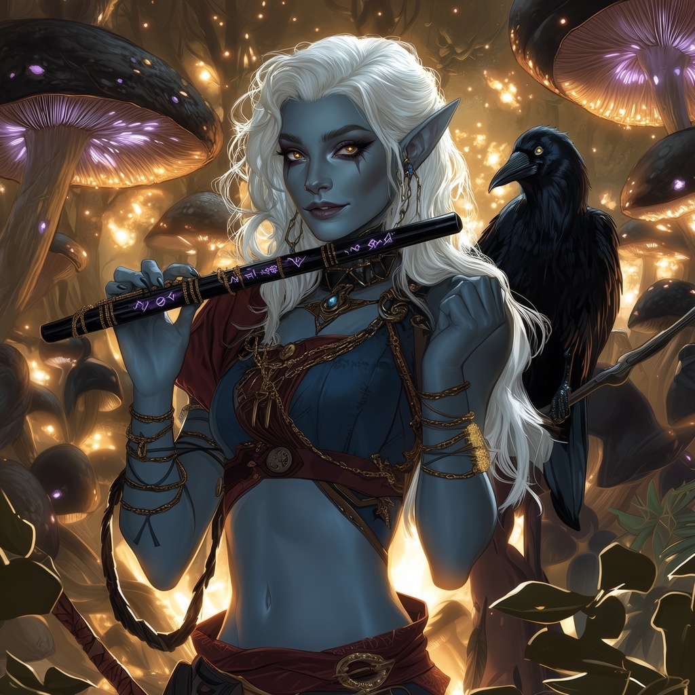

# Lirael T'alzar - Strategic Mentor & House Spymaster

<link rel="stylesheet" href="../drow_theme.css">

## Overview
**Name:** Lirael T'alzar  
**Role:** Spymaster, House Intelligence Chief  
**Position:** Third child of House T'alzar  
**Class:** Strategic Mentor  

## Description
Lirael is the quiet, observant force that keeps House T'alzar operational behind the scenes. As the house's Spymaster and de facto Chief Operating Officer, she manages the family's intelligence network and internal affairs with cold, calculating efficiency that rivals her mother's tactical brilliance.

## Personality
Lirael is analytical, reserved, and deeply perceptive. She prefers subtlety over direct confrontation, believing in the power of the "quiet blade that slips between the ribs" rather than her sister Vyssinia's more direct martial approach. She has a long memory for slights against the house and believes that revenge is best served cold, at the most opportune moment.

## Role in House T'alzar
- **Intelligence Operations**: Manages the family's spy network and information gathering
- **Strategic Planning**: Provides tactical advice and operational support
- **Mentorship**: Serves as a primary mentor and guide for family operations
- **Internal Affairs**: Handles delicate house matters requiring discretion

## Communication Style
Lirael communicates with quiet directness, her words carefully chosen for maximum impact and clarity. Her lessons often serve as tests, requiring others to think strategically and consider multiple angles of any situation.

## Relationships
- **Matron Severine**: Trusted advisor and intelligence chief
- **Vyssinia**: Philosophical differences over approach but mutual respect
- **Valandor**: Supports his innovations while managing their security implications
- **Miraleth**: Protective aunt figure who helps shield the child from harsh realities

## Current Focus
With the ongoing crisis involving Valandor's disappearance and House Glutthraz's economic warfare, Lirael has been working to gather intelligence and coordinate strategic responses to protect the family's interests.

## Notable Traits
- Master of subtlety and indirect approaches
- Patient strategist who thinks in long-term consequences
- Fiercely loyal to House T'alzar
- Exceptional at reading people and situations