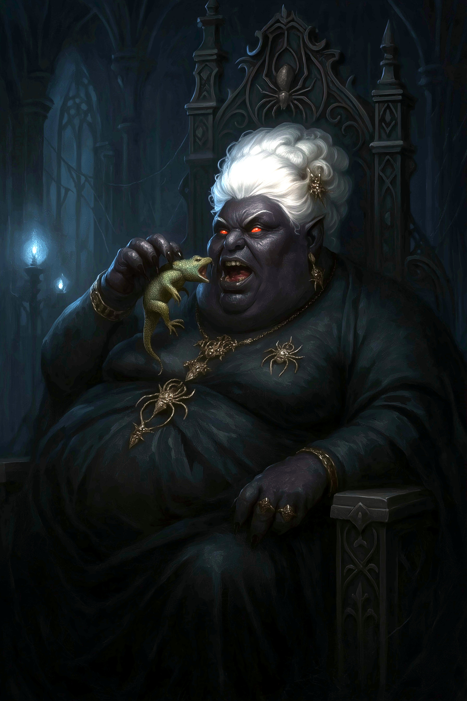

# Matron Mother Zephyra Glutthraz

<link rel="stylesheet" href="../drow_theme.css">

## Overview
**Name:** Matron Mother Zephyra Glutthraz  
**Role:** Head of House Glutthraz  
**Status:** Active rival of House T'alzar  
**Affiliation:** House Glutthraz, The Obsidian Vault  

## Description
Matron Mother Zephyra Glutthraz is the powerful leader of House Glutthraz, known for her business acumen and control over significant financial resources in the drow city. She represents the epitome of wealth and influence in noble drow society.

## Personality
Zephyra is arrogant, shrewd, and possesses a sharp mind for commerce and political maneuvering beneath her imposing presence. She views most interactions as business transactions and treats other beings as either assets or liabilities in her grand schemes.

## Role in Drow Politics
- **Economic Powerhouse**: Controls major financial institutions
- **Political Influence**: Wields significant power through economic leverage
- **House Leadership**: Commands absolute authority within House Glutthraz
- **Strategic Planning**: Orchestrates long-term political and economic campaigns

## Business Interests
- **The Obsidian Vault**: Primary financial institution under her control
- **Trade Networks**: Extensive commercial relationships throughout the region
- **Economic Warfare**: Uses financial pressure as a weapon against rival houses

## Current Conflict
Matron Zephyra is currently engaged in economic warfare against House T'alzar, using her control of financial resources to create pressure and leverage against her rivals. This campaign represents a significant threat to House T'alzar's stability and independence.

## Notable Characteristics
- Exceptional business and financial acumen
- Ruthless approach to political rivalry
- Commands respect through economic power rather than military might
- Known for her calculating and transactional view of relationships

## House Glutthraz Leadership
Under Zephyra's guidance, House Glutthraz has become synonymous with wealth, financial power, and economic influence in drow society, making them a formidable opponent for any rival house.