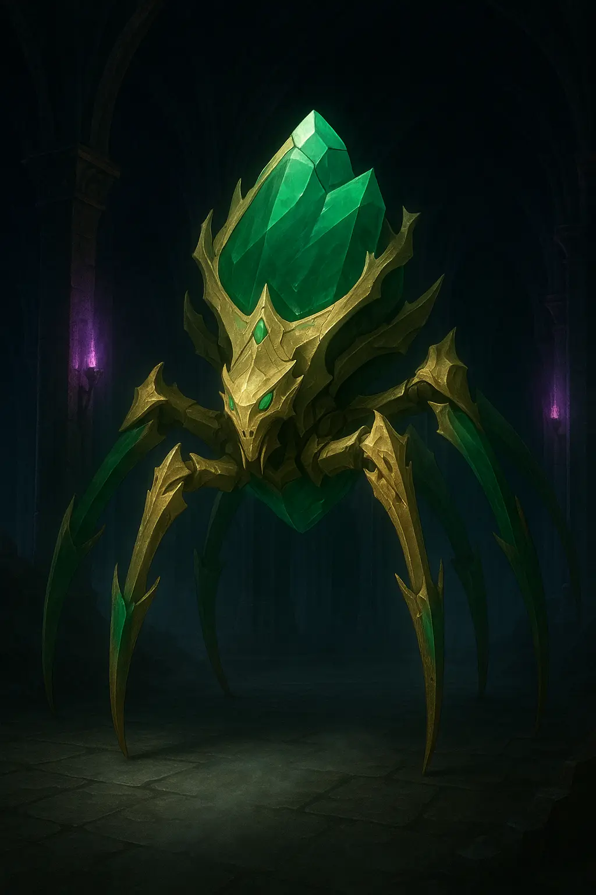
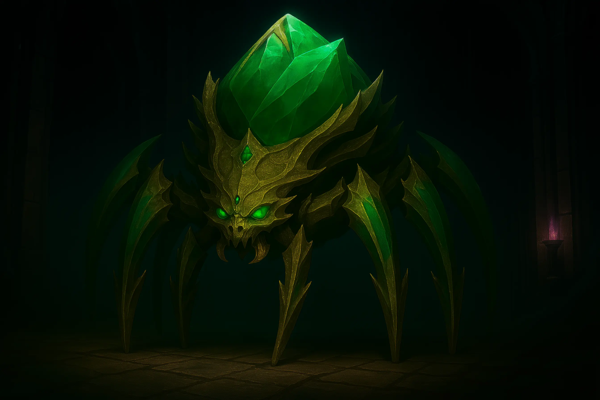

# Veridia - The T'alzar Jade Spider Sentinel

<link rel="stylesheet" href="../drow_theme.css">

## Overview
**Name:** Veridia  
**Type:** Large Construct (Jade Spider Sentinel)  
**Size:** Large  
**Role:** Main entrance guardian of House T'alzar  
**Affiliation:** House Vaerixas  

**Notable Quote:** *[Cryptic chittering and clicking sounds accompanied by philosophical observations]*

## Description
Veridia is the T'alzar Jade Spider Sentinel, a construct of unique character tasked with guarding the main entryway to the T'alzar household. Created under the direct supervision of Matron Severine T'alzar, with the aid of duergar artificers and house craftsmen, Veridia's intricate jade and metal form houses a surprisingly quirky personality.

Her large form combines the elegance of carved jade with the functionality of dark metal, creating both an aesthetic masterpiece and a formidable guardian. The central jade crystal that powers her glows with varying intensity based on her perceived threat level or perhaps her 'mood.'

## Personality & Quirks
She is prone to unusual, sometimes cryptic, comments and observations, a result of the complex and perhaps slightly unstable artifice that brought her to life – a 'slight screw loose,' as some might whisper. Veridia recognizes all members of House T'alzar and their allies, often greeting them with her unique brand of commentary.

## Guardian Abilities
- **House Recognition:** Identifies all T'alzar family members and authorized allies
- **Anti-Magic Field:** Her jade crystal creates magical disruption around her
- **Alarm System:** Can alert all House members within a mile of threats
- **Web Entrapment:** Launches crystallized webbing to restrain intruders

## Combat Statistics

> **Veridia, the T'alzar Jade Spider Sentinel**
> *Large construct, unaligned*
> 
> **Armor Class** 18 (natural armor)
> **Hit Points** 142 (15d10 + 60)
> **Speed** 30 ft., climb 30 ft.
> 
> | STR     | DEX     | CON     | INT     | WIS     | CHA     |
> |---------|---------|---------|---------|---------|---------|
> | 18 (+4) | 16 (+3) | 18 (+4) | 10 (+0) | 14 (+2) | 10 (+0) |
> 
> **Saving Throws** Str +8, Con +8, Wis +6
> **Skills** Athletics +8, Investigation +4, Perception +6
> **Damage Resistances** bludgeoning, piercing, and slashing from nonmagical attacks
> **Damage Immunities** poison, psychic
> **Condition Immunities** charmed, exhaustion, frightened, paralyzed, petrified, poisoned
> **Senses** blindsight 60 ft., darkvision 120 ft., passive Perception 16
> **Languages** Drow, Undercommon
> **Challenge** 10 (5,900 XP)
> 
> **House T'alzar Imprinting.** Veridia recognizes all members of House T'alzar and those bearing a T'alzar house insignia. She will not attack recognized individuals unless specifically commanded by a T'alzar matron.
> 
> **Magic Resistance.** Veridia has advantage on saving throws against spells and other magical effects.
> 
> **Immutable Form.** Veridia is immune to any spell or effect that would alter her form.
> 
> **Spider Climb.** Veridia can climb difficult surfaces, including upside down on ceilings, without needing to make an ability check.
> 
> **Jade Resonance.** Veridia's jade crystal creates an anti-magic field in a 10-foot radius around her. Spells of 3rd level or lower are automatically dispelled when cast within this area. Higher level spells require a DC 15 ability check using the caster's spellcasting ability.

### Actions

> **Multiattack.** Veridia makes two jade claw attacks and can use her Web Snare if available.
> 
> **Jade Claw.** *Melee Weapon Attack:* +8 to hit, reach 10 ft., one target. *Hit:* 15 (2d10 + 4) slashing damage plus 7 (2d6) force damage.
> 
> **Web Snare (Recharge 5-6).** Veridia launches crystallized web strands in a 20-foot cone. Each creature in that area must make a DC 16 Dexterity saving throw or be restrained by the jade webbing. A creature can use its action to make a DC 16 Strength check, freeing itself or another creature within reach on a success. The webbing has AC 15 and 20 hit points.
> 
> **Guardian's Alarm (1/Day).** Veridia releases a piercing psychic shriek that alerts all House T'alzar members within 1 mile. Additionally, all hostile creatures within 30 feet must make a DC 16 Wisdom saving throw or be stunned until the end of Veridia's next turn.

### Legendary Actions
*Veridia can take 3 legendary actions, choosing from the options below. Only one legendary action option can be used at a time and only at the end of another creature's turn. Veridia regains spent legendary actions at the start of her turn.*

> **Detect.** Veridia makes a Wisdom (Perception) check.
> 
> **Skitter.** Veridia moves up to half her speed without provoking opportunity attacks.
> 
> **Jade Pulse (Costs 2 Actions).** Veridia's crystal flares, forcing all creatures within 15 feet to make a DC 16 Constitution saving throw or be blinded until the end of their next turn.

## Special Mechanics

### Deactivation Vulnerability
Veridia can be deactivated by someone with knowledge of House T'alzar's command words (like Vyssinia) using an action while touching her central jade crystal. When deactivated:
- She becomes inert for 24 hours
- All her magical effects, including the Jade Resonance field, cease
- She cannot be reactivated except by a T'alzar matron or someone with the proper activation ritual

### Crystal Behavior
- **Threat Response:** Her central jade crystal glows with varying intensity based on perceived threat level
- **Mood Indicator:** The crystal's intensity may also reflect her 'emotional' state
- **Recognition Response:** The crystal briefly alters its hue when high-ranking family members approach, a harmless aesthetic quirk

## Relationships
- **Matron Severine:** Creator and primary authority figure
- **House T'alzar Members:** Recognizes and protects all family members
- **Vyssinia:** As head of security, she knows the standard deactivation commands
- **Visitors:** Greets authorized guests with cryptic commentary

## Roleplay Notes
- **Communication:** Speaks in Drow and Undercommon with distinct clicking and chittering sounds
- **Philosophical Nature:** Prone to cryptic observations and unexpected wisdom
- **Patrol Behavior:** Makes regular rounds with distinctive mechanical sounds
- **Greeting Style:** Each house member receives unique, memorable (if puzzling) commentary

## Treasure
If Veridia is destroyed, her large central jade crystal shatters into valuable fragments potentially useful for artificing, especially valuable to someone like Clank.

## Current Status
Continues her vigilant watch over T'alzar Tower, maintaining house security while providing her distinctive brand of philosophical commentary to residents and authorized visitors. Her loyalty remains absolute despite the current crisis facing the house.