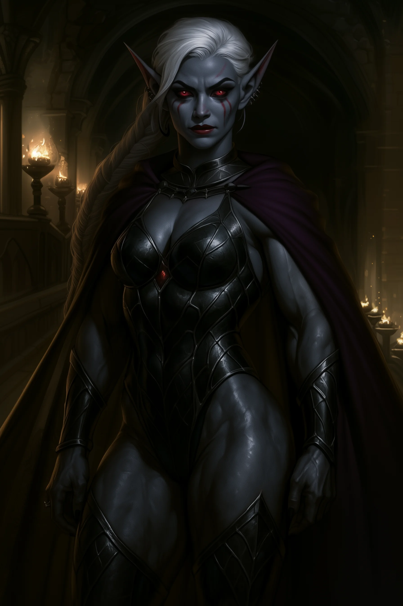

# Vyssinia Talzar - House Champion and Head of Security

<link rel="stylesheet" href="../drow_theme.css">

## Overview
**Name:** Vyssinia Talzar  
**Role:** Head of Security, House Champion  
**Position:** Eldest child of House Talzar  
**Class:** Paladin  

## Description
As the eldest child of House Talzar, Vyssinia was groomed for leadership from an early age. She is a formidable warrior and devout follower of Lolth, serving as both the house's military champion and head of security operations.

## Personality
Vyssinia is proud, ambitious, and deeply committed to her faith. She champions the traditional values of drow society and believes that martial strength and unwavering devotion to Lolth are the cornerstones of true power. She tends to view arcane pursuits and subtle diplomatic approaches as secondary to direct action and martial prowess.

**Core beliefs:**
- Strength and piety lead to lasting power
- Decisive action is key to security
- Traditional drow virtues should guide house decisions
- Faith in Lolth provides divine guidance

## Role in House Talzar
As Head of Security, Vyssinia is responsible for:
- Coordinating house defenses and military assets
- Training and leading house guards and soldiers  
- Serving as the house champion in formal duels
- Advising on security matters and threat assessment

## Relationships
- **Matron Severine:** Respects her mother's leadership while sometimes questioning her pragmatic approach
- **Valandor:** Has a complex relationship with her brother, respecting his brilliance while preferring more traditional methods
- **Lirael:** Often disagrees with her sister's preference for subtlety and espionage
- **Malaggar:** Takes interest in her younger brother's development and potential for following Lolth

## Combat Abilities
Vyssinia is a powerful paladin who combines martial skill with divine magic. She wields a distinctive double-bladed scimitar and is known for her ability to inspire fear in her enemies through sheer presence and unwavering faith.

## Notable Quotes
*"Strength without faith is mere brutality. Faith without strength is empty prayer. True power requires both."*

*"The old ways have served our people for millennia. Innovation is valuable, but tradition is the foundation upon which all greatness is built."*