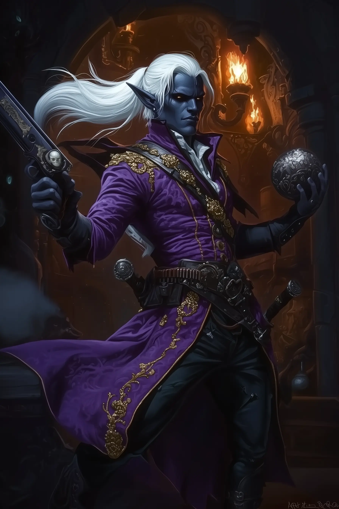

# Player Characters

## **Rav'ithar** 
*   **Race/Class:** Male Drow, Whispers Bard
*   **Role:** Nominal Team Leader & Master Deceiver
*   **Background Notes:** Adopted into House T'alzar as if he were family, Rav'ithar serves as the public face and strategic mind of the team. While his reputation is built on fabricated stories, he has proven to be a capable and ruthless leader. He excels at deception, using his bardic abilities to assume the forms of his victims and orchestrate complex ambushes. He once gained critical intelligence by consuming a slain enemy's memories. His tactical use of spells like *Silence* has been key to the party's silent, systematic slaughter of their enemies.

## **Malaggar (Youngest Son of House T'alzar)** 
*   **Race/Class:** Male Drow, Gloomstalker Ranger
*   **Role:** Lieutenant & Deadly Striker
*   **Background Notes:** As the team's lieutenant, Malaggar is a highly effective and brutal combatant whose Gloomstalker abilities make him a terror in an ambush. He often works in tandem with Bentham to silently eliminate sentries. Despite his lethality—personally executing a captured researcher with "brutal efficiency"—he has shown moments of surprising compassion, such as comforting his young niece, Miraleth, and taking the time to feed a lonely, captive Underdark shark.

## **Haribo the Spreader, Knight of the Musca** 
*   **Race/Class:** Myconid, Spore Druid
*   **Role:** Healer & Battlefield Controller
*   **Background Notes:** A brave and creative member of the team. Haribo has used his Wild Shape ability to perform dangerous solo scouting missions and shows compassion for creatures, befriending a cave spider and comforting Miraleth with summoned fey. In combat, he is a crucial healer (saving Rav'ithar's life) and a clever tactician, using spells like *Spike Growth* to control the battlefield and even using a foundry's portcullis as a weapon.

## **Mordath "Clank" Ironshroud** 
*   **Race/Class:** Duergar, Artificer
*   **Role:** Clan Crafter & Pragmatic Support
*   **Background Notes:** The team's brilliant but sometimes clumsy tinkerer. True to his Duergar nature, Clank is practical and resourceful, always seeking to salvage spare parts from fallen constructs. While providing reliable ranged support in combat, his eagerness has sometimes led to mishaps, such as initiating an ambush prematurely. He is driven by a deep-seated hatred for surface dwellers and a desire to forge a new legacy for his people.

## **Bentham ("The Loyal Shadow")** 
*   **Race/Class:** Doppelganger, Assassin
*   **Role:** Master Infiltrator & Executioner
*   **Background Notes:** A terrifyingly effective and silent killer, fiercely loyal to his Matron Mother. Bentham's Doppelganger abilities are central to the team's strategy of infiltration and deception; he masterfully assumes the forms of victims to lure others into traps. As an Assassin, his first strike is almost always lethal. He displays a chillingly cruel streak, taunting his victims, yet is pragmatic enough to de-escalate situations to maintain cover.

## **Zyntra** 
*   **Race/Class:** Female Drow, Arcane Trickster (Urchin Background)
*   **Role:** Outsider & Arcane Striker
*   **Background Notes:** A resourceful and spunky addition to the team, bringing valuable skills from her life as a street urchin. Zyntra contributes with her arcane spells like *Green-Flame Blade* in combat and her thieving skills in identifying valuables and attempting to disarm traps. While her attempts aren't always successful, her contributions have been vital to the party's coordinated assaults.

