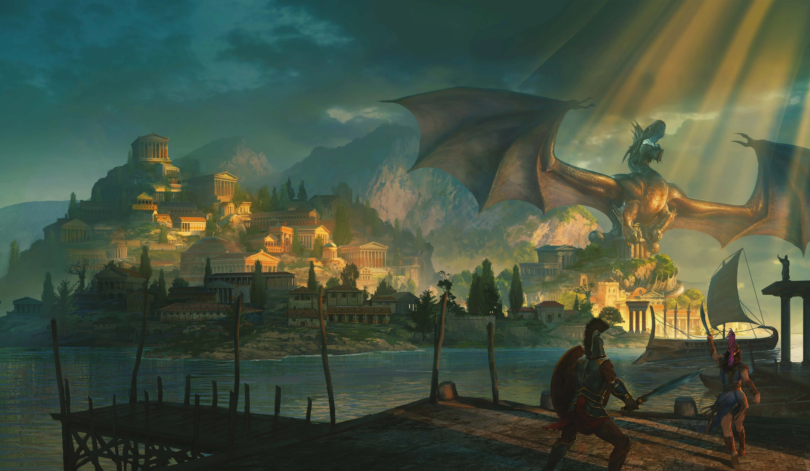

# Wednesday Campaign

  

Welcome to the Wednesday campaign! Here you’ll find recaps, character info, and more.

---

## Looking for New Players!

We are currently looking for two more players to join our Wednesday night "Odyssey of the Dragonlords" D&D 5e campaign.

### The Pitch
Embark on an epic journey in the world of Theros! Inspired by ancient Greek mythology, "Odyssey of the Dragonlords" is a 5e campaign where you will become heroes destined to challenge the Dragonlords themselves.

### The Vibe
*   High fantasy adventure with a touch of Greek tragedy.
*   Explore a vibrant world filled with gods, monsters, and mythical creatures.
*   Forge your own legend and shape the fate of Theros.

### Who We're Looking For
*   Two reliable players (21+) for a character-driven story.
*   We want someone excited by grand adventures and heroic tales.
*   A team player who enjoys collaborative storytelling and epic quests.

### Your Character
Create a hero worthy of legend! All classes and character concepts are welcome, but a strong connection to the world of Theros is encouraged.

### The Details
*   **When**: Wednesdays, 6:30 PM to 10:30 PM
*   **Where**: We play in the [Crescent Heights neighborhood of St. Petersburg, FL](https://www.google.com/maps/place/Crescent+Heights,+St.+Petersburg,+FL+33704/@27.7957706,-82.6440311,18z/data=!3m1!4b1!4m6!3m5!1s0x88c2e1672ab42fdf:0xa01c80cba8acd4a9!8m2!3d27.7948849!4d-82.6415919!16s%2Fg%2F1tj4zhds?entry=ttu&g_ep=EgoyMDI1MDcyMy4wIKXMDSoASAFQAw%3D%3D).
*   **Vibe**: Established, casual group. We share food/drinks.

### How to Apply
If you're interested, please email us at **st.pete.dnd@outlook.com**. We're looking for players who are ready to embrace their destiny and can join us every Wednesday night. 