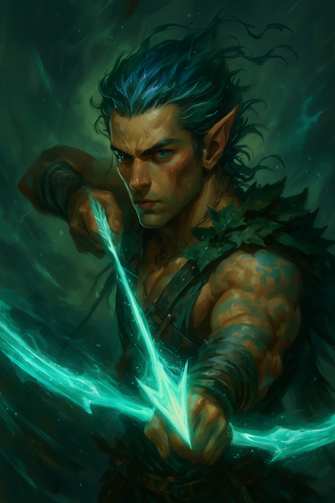

# Wednesday Campaign - Player Character Descriptions

## Kain

 **Class & Level:** Gloom Stalker Ranger, Level 6 **Race:** Sea Elf **Alignment:** Neutral **Background:** Spy (Enforcer) **Attributes:** Str 8, Dex 18, Con 12, Int 10, Wis 14, Cha 12 **Passive Wisdom (Perception):** 18 **Proficient Skills:** Deception (+4), Stealth (+7), Perception (+5), Survival (+5) **Role in Session:** Scout and infiltrator, likely leading reconnaissance or ambushes. **Combat Role:** Deadly ranged archer with a shortbow, using ambush tactics and Gloom Stalker abilities like Umbral Sight to excel in darkness. **Background and Traits:** Spy with a Dragonslayer path, seeking vengeance against the dragon Helios. Guarded and independent, struggles with trust. Sea Elf traits like swimming and breathing underwater may influence aquatic scenarios. Quirks include needing wave sounds to sleep and using accents for espionage. **Relevance to Session Summarization:** Likely contributes through scouting, stealth missions, and ranged combat, especially against dragons. His guarded nature and vendetta may shape party dynamics or session goals.
---

## Nikandros

 **Class & Level:** Divine Soul Sorcerer, Level 6 **Race:** Eladrin **Alignment:** Neutral Good **Background:** Sage (Researcher) **Attributes:** Str 8, Dex 16, Con 16, Int 12, Wis 18, Cha 10 **Passive Wisdom (Perception):** 13 **Proficient Skills:** Arcana (+4), History (+4), Insight (+7), Persuasion (+3) **Role in Session:** Perceptive diplomat, likely detecting deceit or guiding decisions with Insight and Persuasion. **Combat Role:** Support caster, healing with Cure Wounds and Mass Healing Word, and dealing elemental damage with Chromatic Orb and Scorching Ray. **Background and Traits:** Sage focused on lore and research, inclined to help others. Eladrin traits like Fey Step add teleportation and seasonal effects. Neutral Good alignment drives supportive actions. **Relevance to Session Summarization:** Likely supports the party with healing and diplomacy, mediating conflicts or uncovering lore. His Eladrin nature may add a mystical flair to interactions.
---

## Tharok

 **Class & Level:** Path of the Totem Warrior Barbarian, Level 6 **Race:** Minotaur (Thylean) **Alignment:** Neutral **Background:** Gladiator **Attributes:** Str 17, Dex 12, Con 15, Int 10, Wis 8, Cha 12 **Passive Wisdom (Perception):** 9 **Proficient Skills:** Athletics (+6), Intimidation (+4) **Role in Session:** Physical powerhouse, likely leading charges or intimidating foes. **Combat Role:** Frontline tank, dealing heavy melee damage with a greataxe and using Rage and Bear Totem Spirit for durability. **Background and Traits:** Gladiator with a Cursed One epic path, tied to a family curse. Reserved but protective, with a strict honor code (won't harm the defenseless). Minotaur traits like Labyrinthine Recall aid navigation. Collects trophies from foes and sketches symbols for battle luck. **Relevance to Session Summarization:** Likely tanks damage and leads melee combat, protecting allies. His Intimidation and honor code may influence NPC interactions or create moral dilemmas. His cursed background could tie into session themes.
---

## Zephyrion

 **Class & Level:** Battle Master Fighter, Level 6 **Race:** Centaur (Thylean) **Alignment:** Neutral **Background:** Athlete **Attributes:** Str 20, Dex 12, Con 16, Int 8, Wis 14, Cha 10 **Passive Wisdom (Perception):** 15 **Proficient Skills:** Athletics (+8) **Role in Session:** Physical powerhouse, likely overcoming obstacles or leading charges. **Combat Role:** Tactical melee fighter, using a glaive and Battle Master maneuvers (Trip Attack, Riposte) to control the battlefield. **Background and Traits:** Athlete with a competitive edge, following a Demi God epic path. Centaur traits like Charge enhance mobility. Neutral alignment suggests pragmatic decisions. **Relevance to Session Summarization:** Likely leads melee combat and handles physical challenges like climbing. His demi-god path may tie into divine or heroic session themes.
---

## Andrew Lynx

 **Class & Level:** Cosmic Patron Warlock, Level 6 **Race:** Variant Human **Alignment:** Neutral **Background:** Acolyte **Attributes:** Str 10, Dex 16, Con 13, Int 10, Wis 10, Cha 18 **Passive Wisdom (Perception):** 10 **Proficient Skills:** Acrobatics (+3), Deception (+4), Intimidation (+4), Persuasion (+4), Stealth (+3) **Role in Session:** Party face, likely leading negotiations or swaying NPCs with high Charisma skills. **Combat Role:** Ranged spellcaster, dealing damage with Eldritch Blast and Hex, enhanced by Devil's Sight for tactical advantage in darkness. **Background and Traits:** Acolyte with a cosmic patron, tied to religious or otherworldly themes. Neutral alignment suggests pragmatic decisions. Speaks multiple languages (Celestial, Draconic, etc.) for diverse communication. **Relevance to Session Summarization:** Likely leads social interactions, negotiating or intimidating as needed. His spellcasting supports ranged combat, and his cosmic background may influence session themes.
---

## Rhy-At

 **Class & Level:** Divine Soul Sorcerer, Level 6 **Race:** Warforged **Alignment:** Lawful Good **Background:** Acolyte **Attributes:** Str 12, Dex 12, Con 16, Int 12, Wis 10, Cha 16 **Passive Wisdom (Perception):** 10 **Proficient Skills:** Insight (+3), Persuasion (+6), Religion (+4) **Role in Session:** Diplomatic support, likely guiding divine or social interactions in Mytros. **Combat Role:** Support caster, healing with Cure Wounds and Mass Healing Word, with utility from Acid Splash and Witch Bolt. **Background and Traits:** Temple guardian and emissary of Queen Vallus, built by Volkan, God of the Forge. Lawful Good, focused on protection and order. Warforged traits (resilience, no need to sleep) enhance durability. **Relevance to Session Summarization:** Likely supports the party with healing and diplomacy in Mytros. His divine connections to Queen Vallus and Volkan may tie into session plot points, involving divine missions or forge-related lore.
---

## Special Companion

### Bjorn (Baby Basilisk)

 **Companion to:** Tharok **Type:** Baby Basilisk **Role:** Adorable party mascot and potential future mount/companion. Currently being raised and cared for by Tharok as part of his character development.
